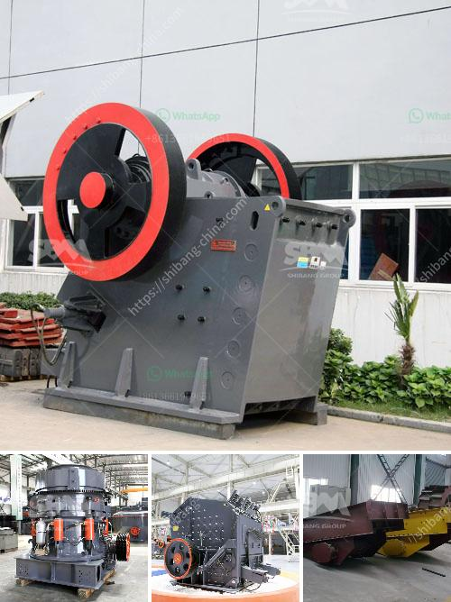

<h3>crushing pf impact crusher</h3>
When it comes to crushing materials, the PF impact crusher is the go-to option for most industrial applications. With its durable construction, high efficiency, and reliable performance, it has become a staple in many industries.

The PF impact crusher stands for "Powered by impact," as it relies on a hammer-like mechanism to crush materials. This specialized design allows the machine to deliver a high reduction ratio, resulting in a product with desirable specifications. Whether it be limestone, granite, or concrete, this crusher can handle it all.

One of the key features of the PF impact crusher is its adjustable discharge size. This means that users can customize the final product to meet their specific needs. From large aggregates to fine particles, this machine can produce the desired outcome every time.

Furthermore, the PF impact crusher is equipped with a heavy-duty rotor that not only enhances its crushing capability but also ensures durability. This rotor is designed to withstand the toughest materials and operates smoothly, reducing the risk of downtime or maintenance issues.

In terms of energy efficiency, the PF impact crusher excels. Its advanced technology reduces energy consumption without compromising on performance. As a result, operators can save on operating costs while still achieving high-quality crushed materials.

Another advantage of the PF impact crusher is its ease of maintenance. The machine's design allows for quick and hassle-free access to key components, making maintenance and repairs a breeze. This translates to increased productivity and reduced downtime, resulting in a more efficient crushing process.

Overall, the PF impact crusher is a reliable and versatile machine that can crush a variety of materials with ease. Its adjustable discharge size, heavy-duty rotor, energy efficiency, and easy maintenance make it a top choice for crushing applications. Whether in construction, mining, or recycling, this crusher excels in delivering high-quality crushed materials.
<h3>Contact us</h3><ul><li><strong>Whatsapp:&nbsp;<a href="https://wa.me/8613661969651">+8613661969651</a></strong></li><li><a href="https://swt.shibang-china.com/?git&amp;zhl&amp;crushing pf impact crusher"><strong>Online Service(chat now)</strong></a></li></ul><h3>Related</h3><ul><li><a href='china clay processing plant cost in india.md'>china clay processing plant cost in india</a></li><li><a href='mtm 160 trapezium mill shanghai.md'>mtm 160 trapezium mill shanghai</a></li><li><a href='malaysia grinder hammer mill manufacturer.md'>malaysia grinder hammer mill manufacturer</a></li><li><a href='crusher machine to make crushed sand from mm.md'>crusher machine to make crushed sand from mm</a></li><li><a href='complete stone crushing 300 tph plant.md'>complete stone crushing 300 tph plant</a></li></ul>