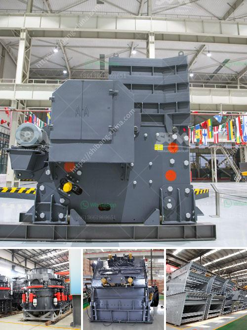

<h3>crushing plant tenova</h3>
In today's competitive industrial landscape, efficiency and productivity are key factors determining the success of any business. This holds especially true in the mining and minerals processing sector, where high-quality equipment is essential to optimizing operations. Enter the crushing plant Tenova, a technological marvel that is revolutionizing the way mining companies extract valuable minerals.

The Crushing Plant Tenova is a cutting-edge solution designed to maximize efficiency, reduce operating costs, and increase profitability for mining companies worldwide. Developed by the reputable engineering company Tenova, this plant encompasses state-of-the-art technology and the latest advancements in processes and equipment.

One of the standout features of the Crushing Plant Tenova is its high level of flexibility. The plant can be easily configured to meet the specific needs of each mining operation, ensuring optimum performance in any situation. Whether it's processing hard rock, soft rock, or any other type of material, the Tenova Crushing Plant ensures reliable and consistent results.

The heart of the Crushing Plant Tenova lies in its advanced crushing system, which is powered by a powerful and efficient crusher. This state-of-the-art equipment is capable of reducing large rocks into smaller, more manageable sizes, ensuring an efficient and productive operation. The crusher's high-speed crushing action enables it to process large volumes of material with ease, ensuring minimal downtime and maximum productivity.

Furthermore, the Crushing Plant Tenova boasts a sophisticated control system, allowing operators to monitor and adjust the various processes seamlessly. This real-time control enables rapid response to any changes in material characteristics or production requirements, ensuring the plant operates at its peak efficiency at all times. Additionally, the control system provides valuable data and analytics that allow for optimization and continuous improvement of the operation.

In addition to its unrivaled crushing capabilities, the Crushing Plant Tenova also incorporates an efficient screening system. This system ensures only the desired end product is obtained, eliminating any unnecessary material and reducing waste. By effectively separating the desired material from the rest, the plant significantly increases efficiency and reduces operating costs.

The Crushing Plant Tenova also sets new benchmarks in terms of safety and environmental responsibility. Tenova prioritizes the well-being of employees and the preservation of the environment, incorporating the latest safety features and engineering practices into the design of their equipment. By reducing emissions and implementing sustainable practices, the plant not only ensures compliance with environmental regulations but also promotes a greener and more sustainable mining industry.

In conclusion, the Crushing Plant Tenova is a game-changer in the mining and minerals processing industry. With its unparalleled efficiency, flexibility, and productivity, the plant is setting new benchmarks for the extraction of valuable minerals. Mining companies worldwide can now rely on this state-of-the-art technology to improve operations, reduce costs, and increase their bottom line. Tenova has once again proven its commitment to innovation and excellence, solidifying its position as a leading provider of advanced solutions for the mining industry.
<h3>Contact us</h3><ul><li><strong>Whatsapp:&nbsp;<a href="https://wa.me/8613661969651">+8613661969651</a></strong></li><li><a href="https://swt.shibang-china.com/?git&amp;zhl&amp;crushing plant tenova"><strong>Online Service(chat now)</strong></a></li></ul><h3>Related</h3><ul><li><a href='crusher for crushing ore in gold mining plant.md'>crusher for crushing ore in gold mining plant</a></li><li><a href='manufacturers of mobile crushing plants.md'>manufacturers of mobile crushing plants</a></li><li><a href='about used stone crushers in america.md'>about used stone crushers in america</a></li><li><a href='sliding shoe bearing ball mill skf.md'>sliding shoe bearing ball mill skf</a></li><li><a href='mill to pulverize stone crusher.md'>mill to pulverize stone crusher</a></li></ul>