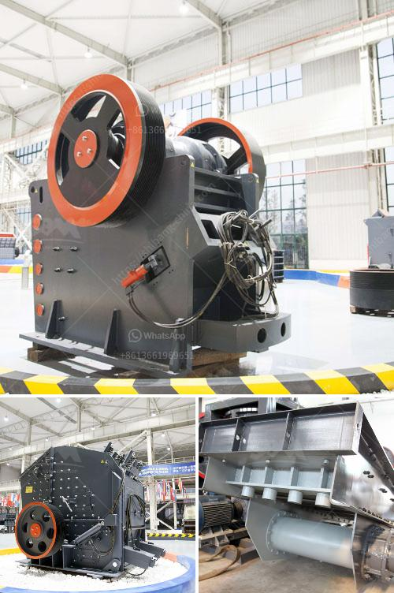

<h3>crushing plants for sale in sri lanka</h3>
Sri Lanka has abundant resources of granite, pebbles, limonite and mineral sands, as well as several natural types of clay mines, coal and gemstones. Recent years, Sri Lanka has witnessed a growth in the export of value-added mineral products and is now powering the mineral-based product manufacturing sector. Indeed, crushing plants play a vast role in the modern mining industry. Without these crushers, mineral exploitation becomes tough and imprecise. Daily excavations of materials bound to be processed in numerous industries cannot be achieved without crushing plants.

Sri Lanka's picturesque landscape and vibrant cities prove to be a story of buzzing infrastructure. Well-designed roads, highways, reservoirs, power stations, and townships result from the nation's commitment to socioeconomic development. To cater to the growing demand for construction materials, crushing plants are essential and play a prominent role in Sri Lanka's construction industry.

Crushing plants offer a wide range of efficient equipment for mining operations and tailing processing. These offers high-efficiency crushing machines, including jaw crushers, cone crushers, and impact crushers. Crushing and screening plants can be utilized in aggregate, recycling, and mining applications where more challenging materials, such as granite or recycled concrete, have to be crushed to a specified size. The modern advanced technology, crushers, and screeners offer high-performance functionality through cutting-edge features such as remote control, durable build, and precise crushing capabilities. 

With the flourishing construction industry in Sri Lanka, the demand for quality aggregate is escalating. To meet the growing demand for various sizes of crushed stone, such as 3/8" and 1/2" (Quality), crushing plants for sale in Sri Lanka can provide various types of materials, mainly for the construction industry. E P Machinery is a reliable crushing machine manufacturer and supplier in Sri Lanka, and they offer the customizable jaw crusher, impact crusher, cone crusher, and other popular models. The complete set of crushing production line manufactured by our company is used in the production of mining equipment and construction sand making equipment.

In recent years, the rapid growth of the Sri Lankan economy has stimulated massive development in the construction industry, making it a significant contributor to the country's GDP. The surge in construction activities in Sri Lanka is expected to continue, providing a significant opportunity for the crushing plant industry. Crushing plants can afford substantial cost reductions in regard to commodity aggregates. Recycled aggregates are becoming increasingly important as a way to utilize the nation's abundance of waste materials.

In conclusion, Sri Lanka's stone crushing industry is an essential part of the country's construction industry, offering opportunities for various types of crushing plants to thrive in the evolving market. Creating sustainable investment opportunities and employing the latest technologies, crushing plants enable the construction industry to progress towards increased efficiency and productivity. So, if you are looking for a cost-effective and environmentally-friendly way to boost your construction business, crushing plants for sale in Sri Lanka might be your best option.
<h3>Contact us</h3><ul><li><strong>Whatsapp:&nbsp;<a href="https://wa.me/8613661969651">+8613661969651</a></strong></li><li><a href="https://swt.shibang-china.com/?git&amp;zhl&amp;crushing plants for sale in sri lanka"><strong>Online Service(chat now)</strong></a></li></ul><h3>Related</h3><ul><li><a href='india grinding machine for talcum powder.md'>india grinding machine for talcum powder</a></li><li><a href='crusher prices of mobile crusher in bolivia.md'>crusher prices of mobile crusher in bolivia</a></li><li><a href='sand making crusher machine.md'>sand making crusher machine</a></li><li><a href='graphite mining equipment in madagascar suppliers.md'>graphite mining equipment in madagascar suppliers</a></li><li><a href='price of recycling equipment in italy.md'>price of recycling equipment in italy</a></li></ul>