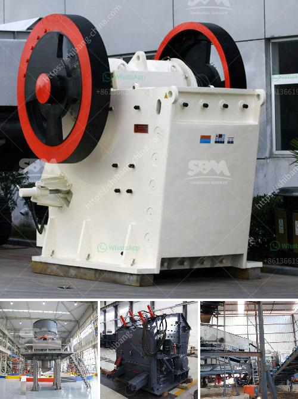

<h3>crushing roller mill japan</h3>
Japan, known for its technological advancements and innovation, continues to excel in various fields, including the agricultural industry. One such technological marvel that has revolutionized Japan's agricultural sector is the crushing roller mill. With its ability to efficiently crush grains and increase output, this innovative machinery has significantly transformed the way farmers operate, ensuring higher yields and greater profitability. This article will explore the impact of crushing roller mills in Japan and how they have become indispensable in modern agriculture.

Crushing roller mills, also known as flaking mills, primarily act as a means of extracting oil from seeds such as soybeans, rapeseed, and more. These mills operate by crushing the seeds, which ruptures the cell walls and releases beneficial oils. This technology not only provides a higher extraction ratio but also aids in preserving the nutrients present in the seeds.

Traditionally, Japan had relied on outmoded and time-consuming methods of seed crushing, resulting in lower yields and often compromising oil quality. However, the advent of crushing roller mills has completely transformed this scenario. With their advanced design and precision, these mills enable farmers to extract oil more efficiently, leading to significantly higher yields per crop.

Apart from improving overall efficiency, crushing roller mills also ensure better oil quality. The advanced crushing mechanism eliminates the possibility of overheating during the extraction process, preventing any alterations in the oil's nutritional composition. As a result, the oil retains its natural flavors, antioxidants, and nutritional value, making it highly sought after both domestically and internationally.

Moreover, crushing roller mills can process a wide range of seeds, ensuring versatility in agricultural production. This further enhances the diversification of the agricultural sector and minimizes waste by utilizing a broader range of seed varieties.

The introduction of crushing roller mills has not only enhanced oil production but also had a positive economic impact on Japan's agricultural industry. With increased yields and higher-quality oil, farmers have experienced a significant surge in profitability. This empowerment allows farmers to invest in modern machinery, expanding their enterprises and contributing to the growth of rural economies.

Additionally, the superior quality of oil extracted from crushing roller mills has opened up new opportunities for exporting Japanese agricultural products. Japan's reputation for technological superiority and quality control has positioned it as a global leader in delivering top-quality oils, attracting international markets and increasing export revenues.

The ascendance of crushing roller mills in Japan's agricultural sector demonstrates the country's commitment to innovation and the pursuit of excellence. By improving the efficiency, quality, and profitability of oil extraction, crushing roller mills have played a pivotal role in boosting yields and transforming the agricultural landscape. Capitalizing on its technological prowess, Japan is now at the forefront of the agricultural industry, paving the way for a brighter and more sustainable future.
<h3>Contact us</h3><ul><li><strong>Whatsapp:&nbsp;<a href="https://wa.me/8613661969651">+8613661969651</a></strong></li><li><a href="https://swt.shibang-china.com/?git&amp;zhl&amp;crushing roller mill japan"><strong>Online Service(chat now)</strong></a></li></ul><h3>Related</h3><ul><li><a href='russia copper ore crushing plant.md'>russia copper ore crushing plant</a></li><li><a href='continuous ball mill for sale in malaysia.md'>continuous ball mill for sale in malaysia</a></li><li><a href='static jaw crusher and plant for sale.md'>static jaw crusher and plant for sale</a></li><li><a href='silica sand crusher machinery.md'>silica sand crusher machinery</a></li><li><a href='sand dryer for sale in zimbabwe.md'>sand dryer for sale in zimbabwe</a></li></ul>