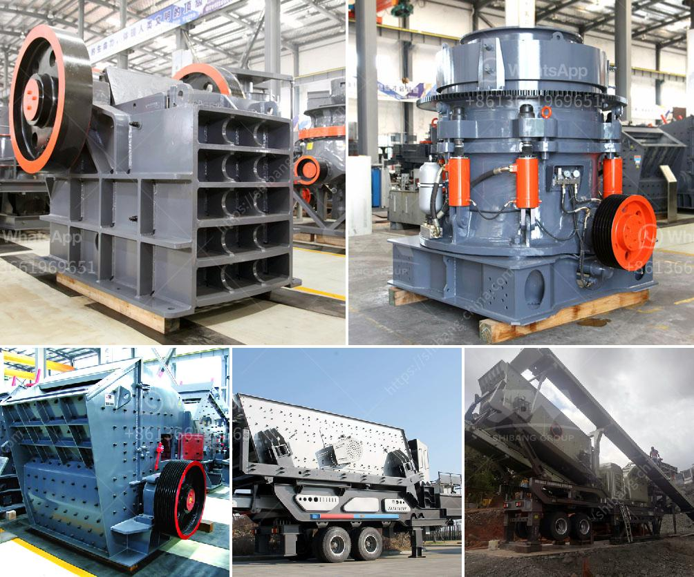

<h3>cs series cone crusher</h3>
The CS series cone crusher is commonly used in the mining and quarrying industry for secondary crushing of various hard ore and rocks. It features a large feed opening and a high crushing capacity, which is especially suited for crushing large-sized materials.

The innovative design of the CS series cone crusher allows for maintenance and operation to be easily performed. The hydraulic system provides safety and adjustable settings for the crusher's closed side setting, enabling consistent gradation and high product quality. The wear parts are made of high manganese steel, ensuring a long lifespan and reduced maintenance requirements.

One of the standout features of the CS series cone crusher is the advanced overload protection system, which safeguards the crusher from high pressures caused by uncrushable material or tramp metal. This feature ensures the equipment's reliability and protects the crusher's internal components.

In terms of performance, the CS series cone crusher offers excellent productivity and reduction ratios. The crusher's unique combination of crushing chamber design and crushing speed provides efficient and high-quality end products. Furthermore, the cone crusher's automation system can automatically adjust the crusher's settings to compensate for variations in the feed conditions, ensuring consistent performance and optimal productivity.

The CS series cone crusher is also known for its high reliability and durability. Robust construction, combined with high-quality components, enables the crusher to withstand heavy-duty operations. Additionally, the cone crusher is equipped with bronze bushings, which enhance the crusher's performance and extend its lifespan.

Furthermore, the CS series cone crusher offers a wide range of optional extras, including a motor with a higher power rating, additional data link options, and a remote control, allowing for easy and convenient operation. These extras allow users to customize the cone crusher to their specific needs and requirements.

In conclusion, the CS series cone crusher is a high-performance crushing machine suitable for a wide range of applications. Its durable construction, excellent productivity, and advanced features make it an ideal choice for efficient secondary crushing in the mining and quarrying industry. With its innovative design, adjustable settings, and advanced overload protection system, the CS series cone crusher offers outstanding reliability, longevity, and high-quality end products.
<h3>Contact us</h3><ul><li><strong>Whatsapp:&nbsp;<a href="https://wa.me/8613661969651">+8613661969651</a></strong></li><li><a href="https://swt.shibang-china.com/?git&amp;zhl&amp;cs series cone crusher"><strong>Online Service(chat now)</strong></a></li></ul><h3>Related</h3><ul><li><a href='coal washing process machine price.md'>coal washing process machine price</a></li><li><a href='dolomite crushing plant price in india.md'>dolomite crushing plant price in india</a></li><li><a href='concrete aggregates crushing plant for sale.md'>concrete aggregates crushing plant for sale</a></li><li><a href='cost of vertical roller mill.md'>cost of vertical roller mill</a></li><li><a href='conveyor belt supplier in shanghai china.md'>conveyor belt supplier in shanghai china</a></li></ul>