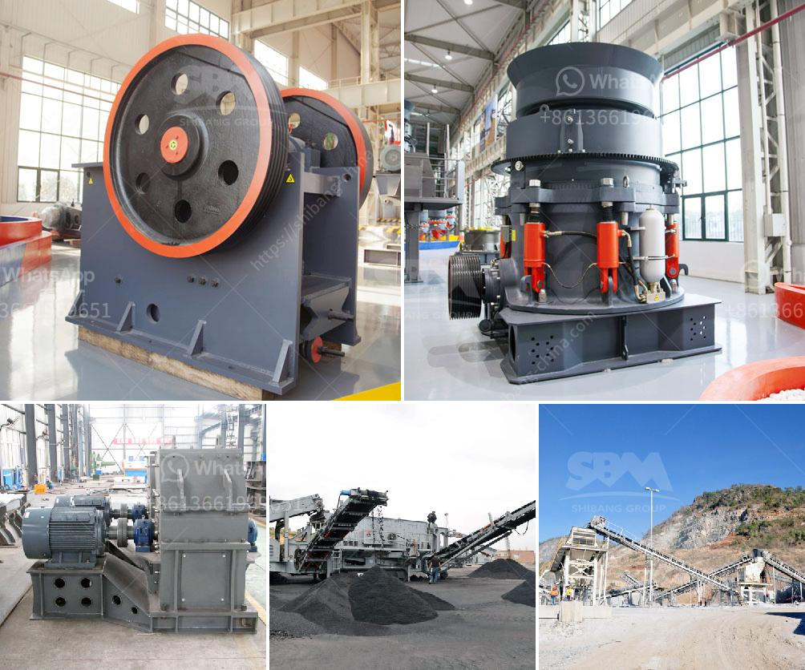

<h3>dealers and manufacturers crusher in europe</h3>
In Europe, the crusher market is growing steadily with the increasing demand for alternative energy sources and the rise in infrastructure development projects. With growing concerns about environmental issues and the need for efficient waste management, crushers have become indispensable machines in various industries.

Manufacturers of crushers in Europe play a crucial role in meeting the demands of customers and building a sustainable future. These manufacturers design and produce innovative crushers that are capable of crushing different types of materials, ranging from construction debris to hard rocks.

The European crusher market is highly competitive, with numerous manufacturers offering a wide range of crushers. These manufacturers constantly strive to improve the performance and efficiency of their machines to meet the evolving needs of customers. They invest heavily in research and development to develop advanced technologies that can enhance the productivity of crushers while reducing their environmental impact.

Dealers in Europe play a vital role in the distribution and marketing of crushers. These dealers work closely with manufacturers to promote their products and provide customers with reliable and efficient crushers. They have extensive knowledge about crushers and can guide customers in choosing the right machine for their specific requirements. Dealers also offer after-sales support, including spare parts and maintenance services, to ensure the longevity and optimal performance of the crushers.

One of the key factors driving the demand for crushers in Europe is the increasing emphasis on recycling and waste management. Europe has strict regulations regarding waste disposal, and crushers have become a critical component in the recycling process. Crushers can efficiently process and reduce the size of various materials, making them easier to handle and recycle. This helps in reducing landfill waste and conserving natural resources.

Crushers are also widely used in the construction industry in Europe. As infrastructure development projects continue to grow, the demand for high-quality aggregates and construction materials has increased. Crushers are used to break down large rocks and stones into smaller sizes, which are then used in various construction applications.

Furthermore, the adoption of renewable energy sources, such as biomass and biofuels, has also contributed to the growth of the crusher market in Europe. Biomass can be converted into energy-rich fuels, and crushers play a crucial role in the processing of biomass materials. They efficiently crush and size biomass, making it suitable for use in energy production through combustion or gasification.

In conclusion, the crusher market in Europe is witnessing steady growth due to the increasing demand for alternative energy sources, infrastructure development projects, and efficient waste management. Manufacturers and dealers in Europe are constantly innovating to meet the evolving needs of customers and address environmental concerns. With their advanced technologies and expertise, they are contributing to the development of a sustainable future.
<h3>Contact us</h3><ul><li><strong>Whatsapp:&nbsp;<a href="https://wa.me/8613661969651">+8613661969651</a></strong></li><li><a href="https://swt.shibang-china.com/?git&amp;zhl&amp;dealers and manufacturers crusher in europe"><strong>Online Service(chat now)</strong></a></li></ul><h3>Related</h3><ul><li><a href='ball mill tons per hour.md'>ball mill tons per hour</a></li><li><a href='techniques chips of metal conveyor belts.md'>techniques chips of metal conveyor belts</a></li><li><a href='principle of operation of stone crusher.md'>principle of operation of stone crusher</a></li><li><a href='cost of cement manufacturing plant tons per day.md'>cost of cement manufacturing plant tons per day</a></li><li><a href='ball mills used in peru.md'>ball mills used in peru</a></li></ul>