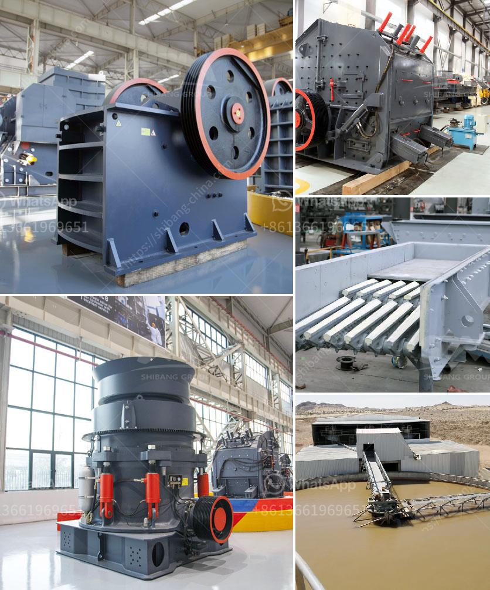

<h3>dealing in portable crusher machine</h3>
Portable crusher machines are essential equipment in the construction and mining industries. These machines provide convenience and flexibility when it comes to crushing stones and other materials. The portability factor of these machines allows operators to transport them to different locations easily. In this article, we will discuss the benefits of using portable crusher machines and how to deal with them effectively.

One of the significant advantages of portable crusher machines is their ability to be moved from one place to another. Traditional crushers are fixed, which limits their usage to a specific location. On the other hand, portable crushers can be easily transported to different sites, allowing contractors to crush materials on-site. This greatly reduces transportation costs and saves time, as there is no need to transport materials to a central crushing location.

Another benefit of portable crusher machines is their versatility. These machines can crush a wide variety of materials, including rocks, concrete, asphalt, and demolition waste. This versatility is especially beneficial in the construction industry, where different materials need to be crushed for various projects. Having a portable crusher machine eliminates the need to rely on multiple crushing machines for various materials, making the crushing process more efficient.

In addition, portable crusher machines are also more environmentally friendly compared to traditional crushers. These machines are equipped with advanced technologies that reduce dust and noise pollution, ensuring a cleaner and healthier working environment. The incorporation of dust suppression systems and noise reduction measures in portable crusher machines makes them more sustainable and compliant with environmental regulations.

Dealing with portable crusher machines requires proper maintenance and handling. Regular inspection and maintenance of these machines are necessary to ensure their optimal performance. Operators should check the machine's components, such as the jaws, conveyor belts, and screens, for any signs of wear or damage. Any issues should be addressed immediately to prevent costly breakdowns and delays in the crushing process.

Proper training of operators is also crucial when dealing with portable crusher machines. Operators should be familiar with the machine's operation and safety procedures to prevent accidents and injuries. Training sessions on machine operation, maintenance, and safety should be provided regularly to ensure that operators are updated with the latest information and practices.

When dealing with portable crusher machines, it is essential to consider the material being crushed and the desired end product. Different crushers are suited for different types of materials and end products. It is crucial to choose the right machine that can effectively crush and produce the desired output.

In conclusion, portable crusher machines offer numerous benefits in the construction and mining industries. Their portability, versatility, and environmental friendliness make them a valuable asset in any crushing operation. Proper maintenance, operator training, and choosing the right crusher machine are key factors in dealing effectively with portable crusher machines. By following these guidelines, operators can maximize the efficiency and productivity of their crushing operations.
<h3>Contact us</h3><ul><li><strong>Whatsapp:&nbsp;<a href="https://wa.me/8613661969651">+8613661969651</a></strong></li><li><a href="https://swt.shibang-china.com/?git&amp;zhl&amp;dealing in portable crusher machine"><strong>Online Service(chat now)</strong></a></li></ul><h3>Related</h3><ul><li><a href='stone crusher manufactured in new zealand.md'>stone crusher manufactured in new zealand</a></li><li><a href='ballast crushers alibaba.md'>ballast crushers alibaba</a></li><li><a href='india grinding machine for talcum powder.md'>india grinding machine for talcum powder</a></li><li><a href='coal processing plant in philippines.md'>coal processing plant in philippines</a></li><li><a href='stone crusher vibrating screen manila.md'>stone crusher vibrating screen manila</a></li></ul>