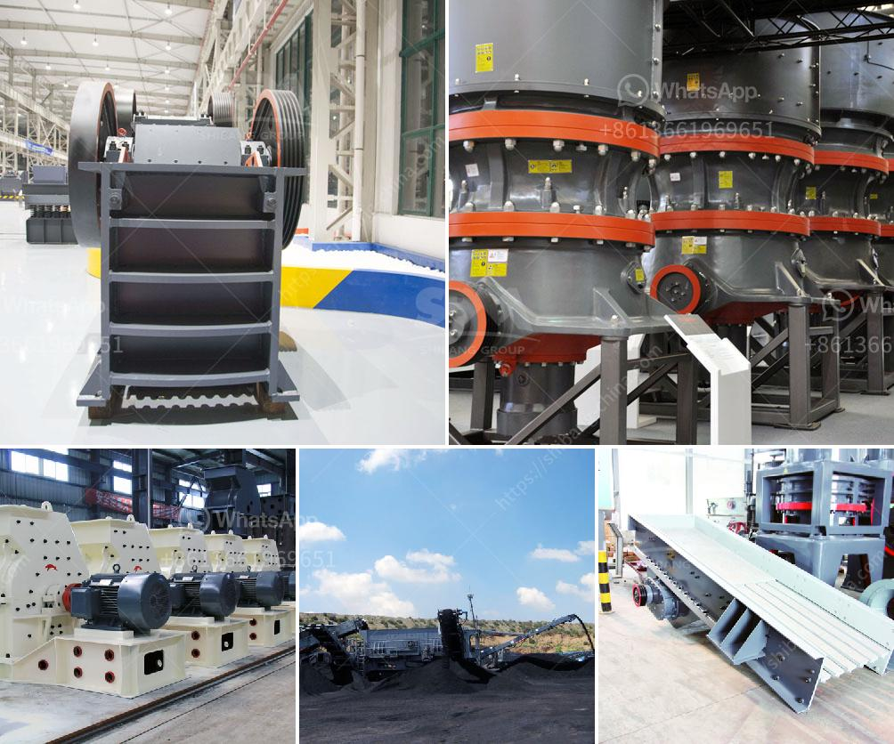

<h3>deed of stone mining business</h3>
Stone mining is an age-old profession that plays a significant role in the construction industry. It involves extracting solid stones like limestone, marble, granite, and sandstone from natural deposits in the earth's crust for various purposes. The stone mining business not only serves as a principal economic activity but also contributes to infrastructural development. However, it is essential to approach this industry with a strong commitment to ethical practices and sustainability. This article explores the deed of stone mining business, delving into its implications for sustainable growth.

The stone mining industry contributes immensely to the economy, particularly in the construction and infrastructure sectors. As the demand for construction materials continues to rise, the availability and quality of stones become crucial. These natural stones are an essential component of building materials such as concrete, asphalt, and aggregates. Additionally, they are widely used for architectural purposes, including decorative elements, flooring, countertops, and sculptures.

A deed refers to a legal document outlining the terms and conditions that govern a particular activity or agreement. In the context of stone mining, a deed ensures adherence to ethical and sustainable practices. It entails a commitment to several aspects that promote responsible mining and safeguard the environment and communities.

A responsible stone mining business prioritizes environmental preservation and mitigating the impact of mining activities. This includes proper land reclamation practices, managing waste and effluents, and minimizing noise and dust pollution. Employing technologies like water recycling systems and dust suppression techniques can significantly reduce the ecological footprint of the mining operations.

A deed of stone mining business should address local community welfare. It involves understanding the socio-economic scenario of the region and ensuring that mining activities do not adversely affect livelihoods. This can be achieved by creating job opportunities, supporting local entrepreneurship, and providing community infrastructure such as schools and healthcare centers.

The safety of the workers involved in stone mining is of utmost importance. The deed should emphasize the implementation of proper safety measures and training programs to prevent accidents and injuries during mining operations. Regular inspections, equipment maintenance, and adherence to health and safety regulations are vital.

To ensure sustainable growth, a responsible stone mining business must focus on the restoration and conservation of natural resources. This involves effective planning and monitoring of mining operations, reforestation efforts, and encouraging biodiversity conservation. Collaboration with environmental organizations and experts can facilitate the development of effective conservation strategies.

The stone mining business is a vital industry that facilitates development in various sectors. However, it is crucial to conduct these operations responsibly and sustainably. The deed of stone mining business serves as a commitment to ethical practices, environmental preservation, social welfare, safety measures, and restoration and conservation efforts. By adhering to such a deed, stone mining businesses can ensure a significant contribution to construction and infrastructure development while treading on the path of sustainable growth.
<h3>Contact us</h3><ul><li><strong>Whatsapp:&nbsp;<a href="https://wa.me/8613661969651">+8613661969651</a></strong></li><li><a href="https://swt.shibang-china.com/?git&amp;zhl&amp;deed of stone mining business"><strong>Online Service(chat now)</strong></a></li></ul><h3>Related</h3><ul><li><a href='blake jaw crusher.md'>blake jaw crusher</a></li><li><a href='cone crushers for sale south africa.md'>cone crushers for sale south africa</a></li><li><a href='vsi crusher plant.md'>vsi crusher plant</a></li><li><a href='used mobile crushers for sale south africa.md'>used mobile crushers for sale south africa</a></li><li><a href='gold wash plant for sale in the usa.md'>gold wash plant for sale in the usa</a></li></ul>