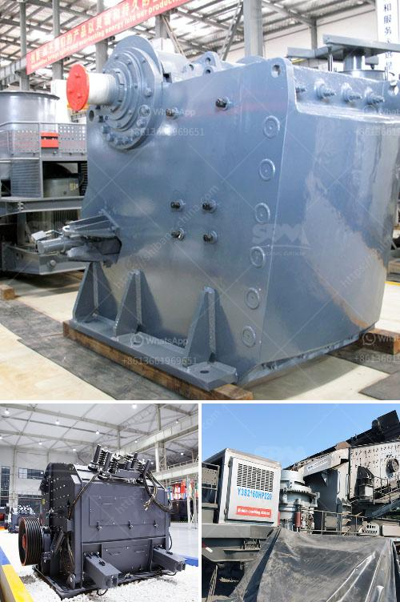

<h3>demand of stage concassage mobile</h3>
The demand for stage concassage mobile, or mobile crushing plants, is on the rise due to their significant benefits and versatility in various industries. These plants have revolutionized the way materials are processed and have become an essential component in construction, mining, and recycling sectors worldwide.

Mobile crushing plants eliminate the need for transportation, as they can be easily moved from one location to another. This flexibility allows for efficient and cost-effective crushing and screening operations on-site, reducing the need for multiple machines and transportation expenses. The process of crushing aggregates, minerals, or even concrete can be done directly at the construction site, resulting in substantial time and cost savings for contractors.

Construction companies, in particular, have recognized the value of stage concassage mobile as it enables them to efficiently process materials and prepare them for reuse. Using a mobile crushing plant, contractors can crush demolished concrete and use it as an aggregate for new construction projects, eliminating the need for additional raw materials and reducing waste disposal costs. This sustainable practice not only saves money but also contributes to environmental preservation.

In the mining industry, stage concassage mobile plants play a crucial role in processing ores and minerals. These plants can crush and screen large volumes of materials, optimizing the efficiency of mining operations. Mobile crushing plants also allow mining companies to bring the processing equipment closer to the extraction site, enabling a continuous flow of operations and reducing the need for expensive transportation of materials.

Moreover, mobile crushing plants are highly customizable, allowing them to be tailored to specific needs and requirements. They can be equipped with various crushing mechanisms, such as jaw crushers, impact crushers, or cone crushers, depending on the type of material being processed. Additionally, advanced control systems can be integrated into these plants, enabling operators to adjust settings and monitor performance in real-time.

The increasing demand for stage concassage mobile is also driven by the growing trend of remote project locations and temporary job sites. Mobile crushing plants can easily be transported to such areas, providing on-site processing capabilities for contractors. This eliminates the need for establishing fixed crushing plants or relying on third-party processing facilities, saving time and ensuring uninterrupted operations.

Overall, the demand for stage concassage mobile is expected to continue to rise as more industries recognize the numerous benefits they offer. The ability to process materials on-site, reduce transportation costs, and customize crushing solutions makes these plants a valuable asset for any company involved in construction, mining, or recycling. With advancements in technology and a greater focus on sustainability, the stage concassage mobile market is set to witness significant growth in the coming years.
<h3>Contact us</h3><ul><li><strong>Whatsapp:&nbsp;<a href="https://wa.me/8613661969651">+8613661969651</a></strong></li><li><a href="https://swt.shibang-china.com/?git&amp;zhl&amp;demand of stage concassage mobile"><strong>Online Service(chat now)</strong></a></li></ul><h3>Related</h3><ul><li><a href='silica sand quarry for sale in tunisia in cork ireland.md'>silica sand quarry for sale in tunisia in cork ireland</a></li><li><a href='crushers double toggle.md'>crushers double toggle</a></li><li><a href='diamond plant for sale in south africa.md'>diamond plant for sale in south africa</a></li><li><a href='crusher information cone crusher mine.md'>crusher information cone crusher mine</a></li><li><a href='quarry plant making machine for sale in zimbabwe.md'>quarry plant making machine for sale in zimbabwe</a></li></ul>