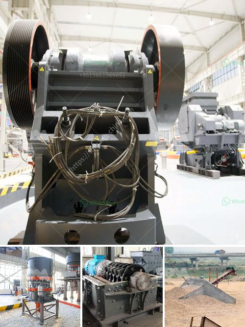

<h3>density of crushed hornfels basalt granite</h3>
The density of crushed hornfels basalt granite is a key parameter when it comes to determining the durability and strength of a material. It plays a significant role in construction and engineering projects, as it affects the load-bearing capacity of the materials used. In this article, we will explore the density of crushed hornfels basalt granite and its implications in various applications.

Crushed hornfels basalt granite is a type of igneous rock that is commonly used in construction projects. It is formed through the cooling and solidification of magma or lava. This process results in a dense, durable rock with a variety of colors and patterns. The density of crushed hornfels basalt granite is affected by several factors, including the composition of the rock and the size of the particles.

The composition of crushed hornfels basalt granite can vary, but it generally consists of minerals such as feldspar, quartz, and mica. These minerals give the rock its strength and durability. The density of crushed hornfels basalt granite is typically in the range of 2.8 to 3.0 grams per cubic centimeter (g/cm3). This density is similar to that of other common construction materials, such as limestone and sandstone.

The size of the particles also affects the density of crushed hornfels basalt granite. Smaller particles tend to have a higher density than larger ones. This is because smaller particles can pack more closely together, increasing the overall density of the material. Crushed hornfels basalt granite is usually available in various sizes, ranging from fine dust to larger chunks.

The density of crushed hornfels basalt granite has several implications in various applications. In construction, it is important to use materials with sufficient density to ensure structural integrity and stability. Dense materials can bear heavier loads without excessive deformation or failure. Therefore, crushed hornfels basalt granite with its high density is often used as a base material for roads, highways, and foundations.

Additionally, the density of crushed hornfels basalt granite affects its porosity, which is the amount of open space or voids in the material. Dense materials have lower porosity, which means they are less likely to absorb water or other liquids. This property makes crushed hornfels basalt granite suitable for use in outdoor applications such as landscaping and drainage systems.

Furthermore, the density of crushed hornfels basalt granite also impacts its thermal and sound insulation properties. Dense materials have a higher resistance to heat transfer and sound transmission. This makes crushed hornfels basalt granite an excellent choice for applications where thermal or acoustic insulation is required, such as in the construction of walls or flooring.

In conclusion, the density of crushed hornfels basalt granite is a crucial characteristic that affects its strength, durability, and various properties. With a density ranging from 2.8 to 3.0 g/cm3, crushed hornfels basalt granite is a dense material that is commonly used in construction projects. Its high density ensures structural stability, while its low porosity makes it suitable for outdoor applications and thermal insulation. Understanding the density of crushed hornfels basalt granite is essential for choosing the right material for specific construction and engineering needs.
<h3>Contact us</h3><ul><li><strong>Whatsapp:&nbsp;<a href="https://wa.me/8613661969651">+8613661969651</a></strong></li><li><a href="https://swt.shibang-china.com/?git&amp;zhl&amp;density of crushed hornfels basalt granite"><strong>Online Service(chat now)</strong></a></li></ul><h3>Related</h3><ul><li><a href='50tpd slag cement grinding unit cost.md'>50tpd slag cement grinding unit cost</a></li><li><a href='mobile crusher for sale in south africa.md'>mobile crusher for sale in south africa</a></li><li><a href='discovery of copper and cobalt in zambia.md'>discovery of copper and cobalt in zambia</a></li><li><a href='process of gravel quarrying crusher.md'>process of gravel quarrying crusher</a></li><li><a href='cost of vertical roller mill.md'>cost of vertical roller mill</a></li></ul>