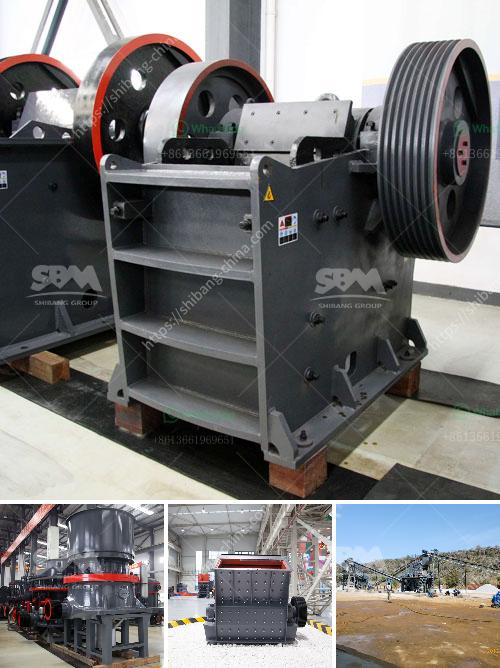

<h3>desain hammer mill dengan pelat rotor pdf</h3>
In the field of mechanical engineering, the hammer mill plays a vital role in the process of grinding and pulverizing materials into smaller particles. Its main function is to reduce the size of the materials by impacting them with hammers, which are attached to a spinning rotor. In recent years, there has been a growing demand for hammer mills with improved design and performance. One such design is the incorporation of a rotor plate, which enhances the grinding efficiency and productivity of the mill.

The design of a hammer mill with a rotor plate involves the addition of a plate to the rotor assembly. This plate acts as a barrier, preventing the material from escaping the grinding chamber before being adequately crushed. By confining the material within the grinding chamber, the rotor plate ensures that the hammers make repeated impacts on the material, resulting in finer particles at a faster rate.

One of the main advantages of incorporating a rotor plate design is the increased control over the particle size distribution. The barrier provided by the plate prevents larger particles from bypassing the grinding process and ensures that all particles are subjected to continuous impact and pulverization. This leads to a more uniform and consistent final product, meeting the desired particle size specifications.

Another key feature of the rotor plate design is its impact on the mill's productivity. The confinement of the material within the grinding chamber allows for a higher feed rate, maximizing the throughput of the mill. Additionally, the repeated impacts induced by the rotor plate reduce the residence time of the material in the grinding chamber, resulting in shorter grinding cycles. This not only improves productivity but also reduces operating costs by saving time and energy.

Furthermore, the incorporation of a rotor plate allows for quick and easy adjustment of the grinding gap. By altering the position of the plate, the gap between the hammers and the plate can be modified, enabling control over the final particle size. This flexibility makes the hammer mill with a rotor plate suitable for a wide range of applications, catering to the diverse needs of industries such as agriculture, food processing, and chemical manufacturing.

The design of a hammer mill with a rotor plate has proven to be a significant advancement in the field of grinding and pulverizing equipment. By confining the material within the grinding chamber and inducing repeated impacts, the rotor plate design enhances grinding efficiency and productivity. It offers control over the particle size distribution, allows for a higher feed rate, and enables quick and easy adjustment of the grinding gap. These features make the hammer mill with rotor plate suitable for various industries, improving their overall performance and profitability. As technology continues to advance, further innovations in the design of hammer mills will undoubtedly arise, providing more efficient and effective solutions for grinding and pulverizing applications.
<h3>Contact us</h3><ul><li><strong>Whatsapp:&nbsp;<a href="https://wa.me/8613661969651">+8613661969651</a></strong></li><li><a href="https://swt.shibang-china.com/?git&amp;zhl&amp;desain hammer mill dengan pelat rotor pdf"><strong>Online Service(chat now)</strong></a></li></ul><h3>Related</h3><ul><li><a href='coal mill manufacturer china.md'>coal mill manufacturer china</a></li><li><a href='germany stone crusher machine factories.md'>germany stone crusher machine factories</a></li><li><a href='stone crusher output per hour india.md'>stone crusher output per hour india</a></li><li><a href='gypsum calcination equipment.md'>gypsum calcination equipment</a></li><li><a href='crawler mobile jaw crusher for sale.md'>crawler mobile jaw crusher for sale</a></li></ul>