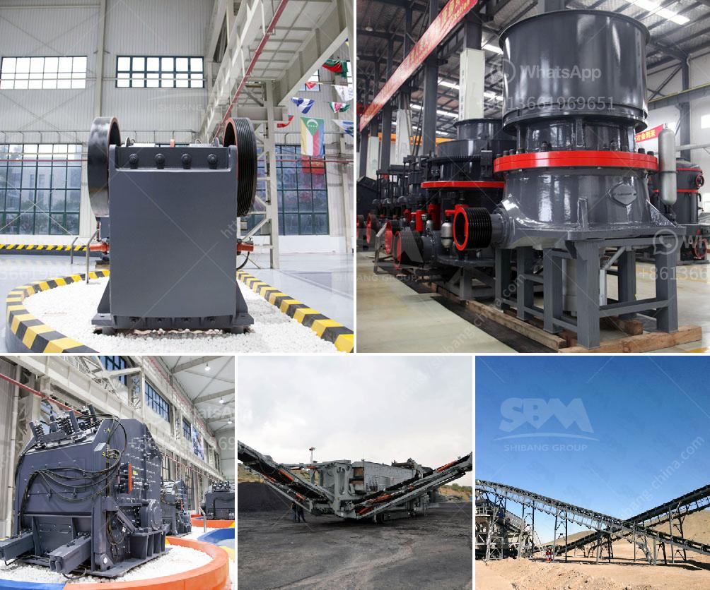

<h3>diamond plant for sale in south africa</h3>
If you are an avid collector of rare and precious plants, then you may want to consider investing in a diamond plant. These stunning and unique plants are not your average flora. Originating from South Africa, diamond plants are known for their strikingly beautiful foliage, which resembles the glimmering facets of a cut diamond. They are truly a sight to behold.

Diamond plants, also known as Mesembryanthemum crystallinum, are succulent plants that thrive in arid conditions, making them perfect for those living in drier regions or for indoor gardening. Their leaves are covered in tiny translucent cells, giving them a crystalline appearance that mirrors the allure of an actual diamond.

These plants are quite hardy and easy to care for, making them an excellent choice for both experienced and novice gardeners. They require minimal watering and prefer well-draining soil. Diamond plants also thrive in full sun or partial shade, making them versatile for various growing conditions.

In South Africa, these unique plants have become increasingly popular among plant enthusiasts, and there are now several nurseries and online retailers offering them for sale. When purchasing a diamond plant, it is essential to choose a reputable seller that specializes in rare and exotic plants. This way, you can ensure that you are getting an authentic diamond plant that will thrive and continue to captivate for many years to come.

Adding a diamond plant to your collection will undoubtedly make your garden or indoor space stand out from the crowd. Its dazzling leaves will catch the light and create a mesmerizing display that is sure to be the envy of any visitor. Whether you are a seasoned plant collector or just starting your gardening journey, owning a diamond plant is an investment in beauty and uniqueness that is not to be missed.

So, if you are looking to add a touch of elegance and rarity to your garden, consider purchasing a diamond plant. With their captivating foliage and easy-care requirements, these South African gems are a must-have for any plant lover. Don't miss the opportunity to own a true natural wonder - a diamond plant!
<h3>Contact us</h3><ul><li><strong>Whatsapp:&nbsp;<a href="https://wa.me/8613661969651">+8613661969651</a></strong></li><li><a href="https://swt.shibang-china.com/?git&amp;zhl&amp;diamond plant for sale in south africa"><strong>Online Service(chat now)</strong></a></li></ul><h3>Related</h3><ul><li><a href='portable stone crushers uganda for sale.md'>portable stone crushers uganda for sale</a></li><li><a href='coltan processing plant prices.md'>coltan processing plant prices</a></li><li><a href='turkey of gold refinery project cost.md'>turkey of gold refinery project cost</a></li><li><a href='quartz powder manufacturing process.md'>quartz powder manufacturing process</a></li><li><a href='crusher stone manufacture from china.md'>crusher stone manufacture from china</a></li></ul>