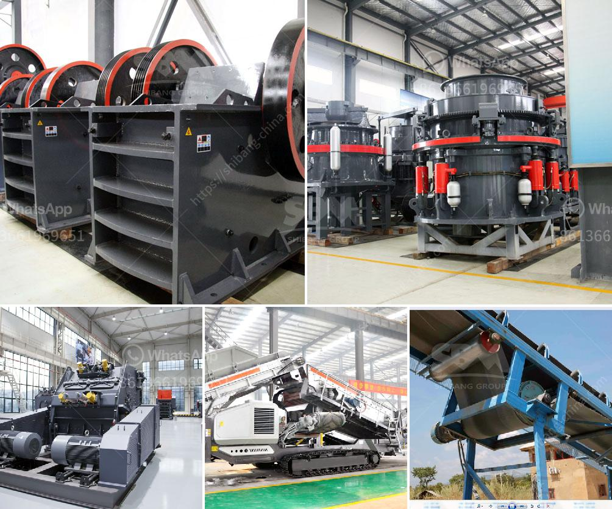

<h3>difference between vsi and sand making machine</h3>
VSI (Vertical Shaft Impactor) and sand making machine are two highly efficient and widely used equipment in the artificial sand making industry. Both of these machines have their own benefits and features, and choosing the right equipment for your sand production process can greatly improve the quality and output of the final product.

The main difference between these two machines lies in their working principle. VSI crushers use high-speed rotors with wear-resistant tips to throw and catch the incoming feed material, which is then crushed against anvils and/or rock shelves. In contrast, sand making machines work by applying a high-speed rotor to crush the material fed into the machine. The stones thrown by the high-speed rotor collide with the rock shelves and crush them into sand particles.

Another significant difference between VSI and sand making machines is their production capacity. VSI machines are known for their higher production capacity compared to sand making machines. The larger crushable material is fed into the VSI crusher, while the smaller sized material is fed into the sand making machine. This difference in feed material size leads to different output capacities.

In terms of the quality of the final product, both machines produce excellent results. VSI crushers and sand making machines are designed to produce high-quality, well-shaped, and fine grains. The choice between these machines depends on the specific requirements of the project and the desired outcome. Some projects may require more angular and rough particles, while others may need smoother and more well-graded sand.

Maintenance and operating costs are other aspects to consider when comparing VSI crushers and sand making machines. VSI crushers generally have higher operating costs due to their more complex design and increased energy consumption. On the other hand, sand making machines have simpler structures and lower operating costs.

In conclusion, both VSI crushers and sand making machines are effective options for producing artificial sand. The choice depends on factors such as production capacity, desired particle size and shape, and maintenance costs. Analyzing the specific requirements of the project will help in making an informed decision and selecting the most suitable equipment for efficient sand production.
<h3>Contact us</h3><ul><li><strong>Whatsapp:&nbsp;<a href="https://wa.me/8613661969651">+8613661969651</a></strong></li><li><a href="https://swt.shibang-china.com/?git&amp;zhl&amp;difference between vsi and sand making machine"><strong>Online Service(chat now)</strong></a></li></ul><h3>Related</h3><ul><li><a href='ball mills for mining.md'>ball mills for mining</a></li><li><a href='china top limestone crusher brands.md'>china top limestone crusher brands</a></li><li><a href='pulverizer cursher manufacturer.md'>pulverizer cursher manufacturer</a></li><li><a href='stone crusher plant hire gold in zimbabwe.md'>stone crusher plant hire gold in zimbabwe</a></li><li><a href='rock crusher equipment.md'>rock crusher equipment</a></li></ul>