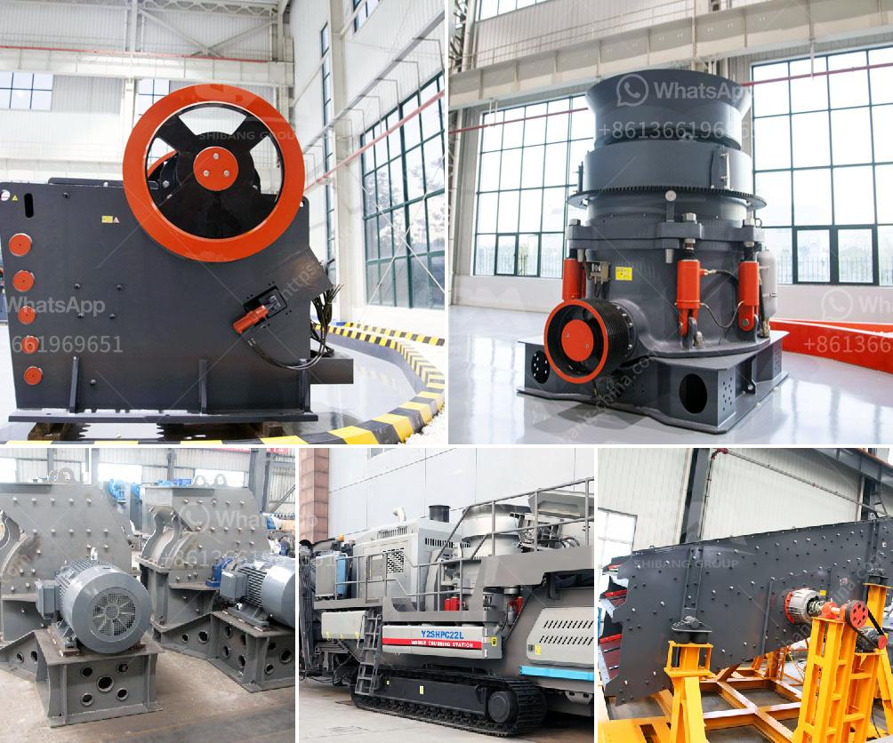

<h3>discovery of copper and cobalt in zambia</h3>
In a groundbreaking development, Zambia, a landlocked country in Southern Africa, has recently discovered massive reserves of copper and cobalt. This discovery has taken the mining industry by storm, with experts predicting huge economic benefits and a significant rise in Zambia's global mining importance.

Zambia has long been renowned for its rich copper deposits, which have fueled its economy for decades. However, the recent discovery of additional copper deposits, along with significant reserves of cobalt, has opened up exciting new opportunities for the country.

Copper, being Zambia's primary resource, has been used for centuries for various purposes. The newfound copper reserves promise to further strengthen Zambia's position as a major global copper producer. The country is already Africa's second-largest copper producer, contributing to nearly 20% of the continent's annual copper output. With this discovery, Zambia's copper production capacity is set to increase significantly.

Moreover, the newfound cobalt reserves have taken the mining industry by surprise. Cobalt is a critical component used in batteries for electric vehicles, making it a highly sought-after resource for sustainable transportation. With the growing demand for electric vehicles worldwide, the discovery of substantial cobalt reserves in Zambia brings immense potential for the country's mining sector and further economic growth.

The government of Zambia has expressed great enthusiasm, recognizing the immense potential these recent discoveries hold for the country's mining industry. Authorities anticipate the creation of numerous job opportunities, increased foreign direct investment, and a boost to the national economy.

Furthermore, the exploration and extraction of these newfound resources might attract global mining giants to invest further in Zambia. This investment would bring state-of-the-art technology, expertise, and sustainable mining practices, ensuring both economic growth and environmental stewardship.

The discovery of vast copper and cobalt reserves in Zambia marks a major turning point for the country's mining sector. With the global demand for these resources rising exponentially, Zambia's mining industry is poised to play a crucial role in meeting the world's copper and cobalt needs, thus driving economic growth and development.
<h3>Contact us</h3><ul><li><strong>Whatsapp:&nbsp;<a href="https://wa.me/8613661969651">+8613661969651</a></strong></li><li><a href="https://swt.shibang-china.com/?git&amp;zhl&amp;discovery of copper and cobalt in zambia"><strong>Online Service(chat now)</strong></a></li></ul><h3>Related</h3><ul><li><a href='200 mesh ore grinder cost.md'>200 mesh ore grinder cost</a></li><li><a href='basalt crushing machine.md'>basalt crushing machine</a></li><li><a href='price of tph stone crusher.md'>price of tph stone crusher</a></li><li><a href='grinding mill manufacturers.md'>grinding mill manufacturers</a></li><li><a href='calcium carbide making machine used.md'>calcium carbide making machine used</a></li></ul>