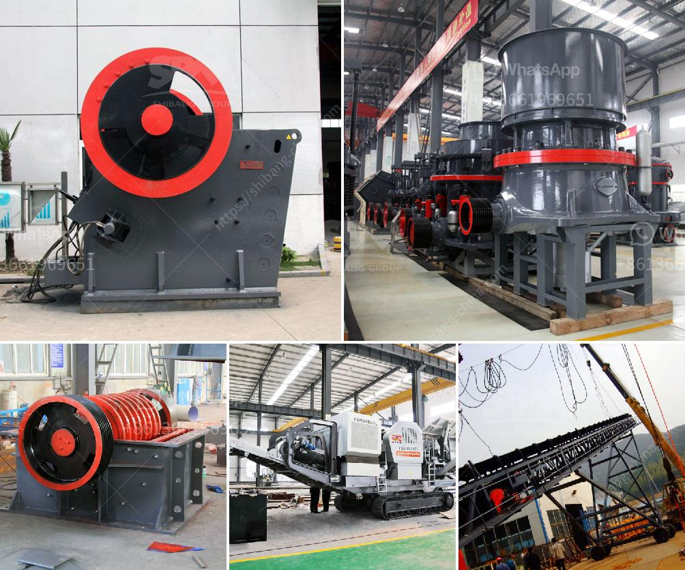

<h3>distributor crusher di indonesia</h3>
Distributor Crusher di Indonesia: Supporting the Indonesian Economy with Efficient Crushing Machinery

Indonesia is one of the world's largest producers of various types of commodities, including minerals, coal, metals, and stone products. With a long mining and manufacturing history, Indonesia has proven itself to be a strong player in the global market. To support the growth of these industries, various infrastructure projects are being implemented, creating a high demand for efficient crushing machinery. This is where distributor crusher di Indonesia plays a crucial role.

A distributor crusher in Indonesia not only provides equipment for the mining industry but also stone crushing units. These machines make the work easier and faster for the miners as they can break down large rocks into smaller ones, making it easier to transport it to other parts of the country. Most of the machines are sold through a distributor in Indonesia, which helps the manufacturers and the distributors to increase their sales and revenue.

The distributor crusher in Indonesia is a specialized piece of machinery that is used for crushing rocks into smaller pieces. The crushers can either be hydraulic pressure machines or mechanical pressure machines. The cone crushers are used for further crushing or shaping, while the gyratory crushers crush the stones into fine particles. Huge stones are then reduced to small stones in the machines used for primary crushing.

The crushers are available in different sizes and capacities. The manufacturers and distributors in Indonesia are mindful of the varying needs of their clients and strive to offer the most suitable crushers for the mining industry. They ensure that these machines are efficient, reliable, and easy to operate. Machinery used in the mining industry is subjected to extreme conditions, so it is essential to choose crushers that are durable and robust.

One of the largest distributors of crushers and spare parts in Indonesia is PT. Marton Tekindo Abadi. They have been providing customers with a wide range of crushers, screens, feeders, and spare parts for stone crushing units. With over 20 years of experience in this industry, they have built a strong reputation for quality and reliability. They work with some of the leading manufacturers in the world to provide the best machinery to their clients.

PT. Marton Tekindo Abadi's products are widely used in various industries such as mining, quarrying, construction, infrastructure, and recycling. They have successfully supplied crushers to some of the biggest projects in Indonesia, which include highway construction, power plant projects, and mining operations. They have a team of experienced engineers who can provide technical support and assist in finding the right crusher for specific needs.

In conclusion, distributor crusher di Indonesia plays a crucial role in the mining and construction industries. As Indonesia continues to develop, the demand for efficient crushing machinery increases, which means there is a growing market for crushers. Ultimately, the success of the mining and construction industries in Indonesia depends heavily on the distributor crusher, as it is the foundational equipment that enables the efficient extraction and preparation of raw materials for further processing.
<h3>Contact us</h3><ul><li><strong>Whatsapp:&nbsp;<a href="https://wa.me/8613661969651">+8613661969651</a></strong></li><li><a href="https://swt.shibang-china.com/?git&amp;zhl&amp;distributor crusher di indonesia"><strong>Online Service(chat now)</strong></a></li></ul><h3>Related</h3><ul><li><a href='ballast quarry crusher machines.md'>ballast quarry crusher machines</a></li><li><a href='dolomite crusher plant in kuwait.md'>dolomite crusher plant in kuwait</a></li><li><a href='stone crusher manufactured in new zealand.md'>stone crusher manufactured in new zealand</a></li><li><a href='sand sieve machine philippines.md'>sand sieve machine philippines</a></li><li><a href='jaw crusher prices.md'>jaw crusher prices</a></li></ul>