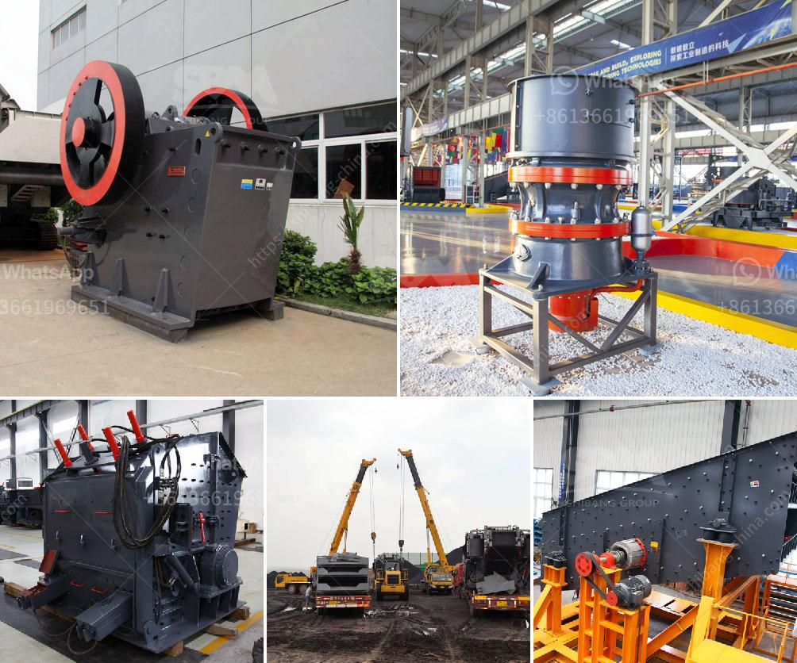

<h3>distributor philippines test sieve retsch</h3>
In the field of quality control and research laboratories, accurate particle size analysis is crucial for various industries such as pharmaceuticals, chemicals, and food processing. A test sieve is a fundamental tool used to measure and classify particles based on their size. One renowned brand that has been trusted by professionals for years is Retsch, and in the Philippines, distributors of Retsch test sieves provide reliable solutions for accurate particle size analysis.

Retsch, a German-based company, has been a leading provider of laboratory equipment since its establishment in 1915. Their test sieves are manufactured to the highest quality standards to ensure accurate and reliable results. These sieves are essential for determining the particle size distribution of granular materials, powders, and other solid samples.

In the Philippines, there are distributors who specialize in supplying Retsch test sieves to various industries. These distributors understand the specific needs of their clients and provide expert advice on selecting the right test sieves for their applications.

One important aspect to consider when choosing a test sieve is the mesh size. Test sieves are available in different mesh sizes, ranging from very coarse to very fine. The mesh size determines the size of particles that can pass through the sieve. It is crucial to select the appropriate mesh size to accurately capture the desired particle size range.

Retsch test sieves are made from high-quality stainless steel or brass, ensuring durability and long-lasting performance. The sieves adhere to international standards, such as ISO 3310-1/2 and ASTM E11, guaranteeing accurate and reliable results. The fine wire mesh is tightly woven to minimize distortion and maintain precise aperture sizes.

To use Retsch test sieves, the sample material is placed on the top sieve and then manually or mechanically shaken. The particles that are too large to pass through the sieve are retained on top, while the smaller particles pass through and collect on the lower sieves. The percentage of particles retained on each sieve is measured, providing valuable information on the particle size distribution.

Aside from standard test sieves, Retsch also offers special sieves for specific applications. Sieves with reinforced frames are available for heavy-duty applications, ensuring longevity under demanding conditions. Wet sieving accessories, such as spray nozzles and receiving pans, allow for precise particle sizing of materials that absorb water. These specialized sieves expand the versatility of Retsch test sieves, catering to a wider range of applications.

Working with a distributor of Retsch test sieves in the Philippines ensures access to genuine products, technical support, and excellent customer service. Distributors understand the importance of accurate particle size analysis and can assist in choosing the most suitable test sieves based on individual requirements. Moreover, they provide after-sales support, calibration services, and spare parts to guarantee reliable and uninterrupted operation of the sieves.

In conclusion, accurate particle size analysis is essential for various industries. Retsch test sieves have been trusted by professionals worldwide for their high quality and reliability. In the Philippines, distributors of Retsch test sieves provide access to these exceptional products, ensuring that industries can achieve precise particle size analysis, leading to improved product quality and efficiency.
<h3>Contact us</h3><ul><li><strong>Whatsapp:&nbsp;<a href="https://wa.me/8613661969651">+8613661969651</a></strong></li><li><a href="https://swt.shibang-china.com/?git&amp;zhl&amp;distributor philippines test sieve retsch"><strong>Online Service(chat now)</strong></a></li></ul><h3>Related</h3><ul><li><a href='cone crusher made in italy.md'>cone crusher made in italy</a></li><li><a href='plant of bentonite crusher.md'>plant of bentonite crusher</a></li><li><a href='river rock crushing equipment.md'>river rock crushing equipment</a></li><li><a href='gold stamp mill for sale zim price.md'>gold stamp mill for sale zim price</a></li><li><a href='stone crusher philippines.md'>stone crusher philippines</a></li></ul>