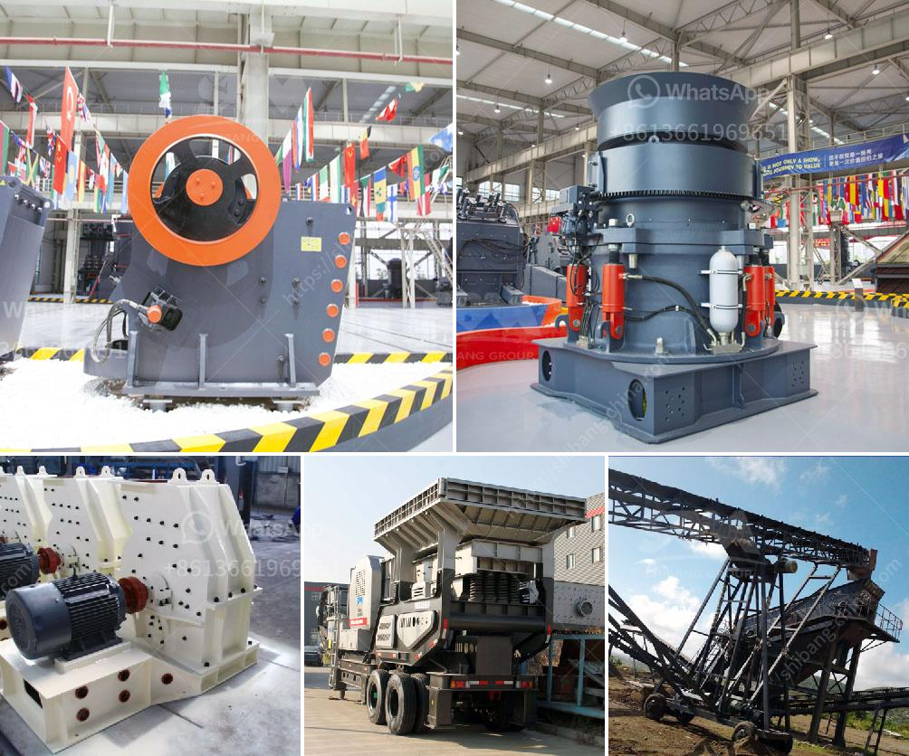

<h3>diy stone crushing machine</h3>
Are you a fan of DIY projects and empowered homeownership? If so, you might be interested in creating your own stone crushing machine. This handy device allows you to quickly and easily crush rocks and stones, providing usable material for projects like landscaping, road construction, and even art installations.

Before we dive into the details, it's important to acknowledge the potential hazards associated with a DIY stone crushing machine. As with any power tool, there are risks involved, so ensure you have proper safety gear, including goggles, gloves, and ear protection. Additionally, consult local regulations and obtain necessary permits if required for your location.

Now, let's discuss the construction process. The primary components of a DIY stone crushing machine are a rotor, anvil, and cage. Firstly, select a sturdy base material, such as steel or wood, for the machine's framework. Then, attach the rotor to the framework using strong bolts or welding. The rotor, typically made of heavy-duty steel, will provide the crushing force necessary to break down the stones.

Next, construct the anvil, which will receive the stones being crushed. Choose a durable and hard material, like cast iron or steel, to ensure longevity and efficiency. Weld or bolt the anvil securely to the framework, taking care to align it with the rotor.

Finally, build the cage that encloses the stones during the crushing process. Consider using thick metal mesh or even steel bars, depending on the size of stones you'll be working with. Weld the cage to the framework, leaving enough space for the crushed material to exit.

Once your DIY stone crushing machine is assembled, you're ready to put it to use. Place rocks or stones into the cage, ensuring they are small enough to fit. Then, activate the machine and watch as it tirelessly crushes the material into smaller fragments. Remember to wear your safety gear and take breaks as needed.

With your very own DIY stone crushing machine, you can transform rocks and stones into versatile materials for various applications. Enjoy the satisfaction of creating something practical and functional while saving money on commercial alternatives. Just remember, safety always comes first!
<h3>Contact us</h3><ul><li><strong>Whatsapp:&nbsp;<a href="https://wa.me/8613661969651">+8613661969651</a></strong></li><li><a href="https://swt.shibang-china.com/?git&amp;zhl&amp;diy stone crushing machine"><strong>Online Service(chat now)</strong></a></li></ul><h3>Related</h3><ul><li><a href='m sand crushing manufacturers in india.md'>m sand crushing manufacturers in india</a></li><li><a href='types of coal crusher used in industry.md'>types of coal crusher used in industry</a></li><li><a href='used portable rock crusher canada.md'>used portable rock crusher canada</a></li><li><a href='mill to pulverize stone crusher.md'>mill to pulverize stone crusher</a></li><li><a href='how to make a roller mill.md'>how to make a roller mill</a></li></ul>