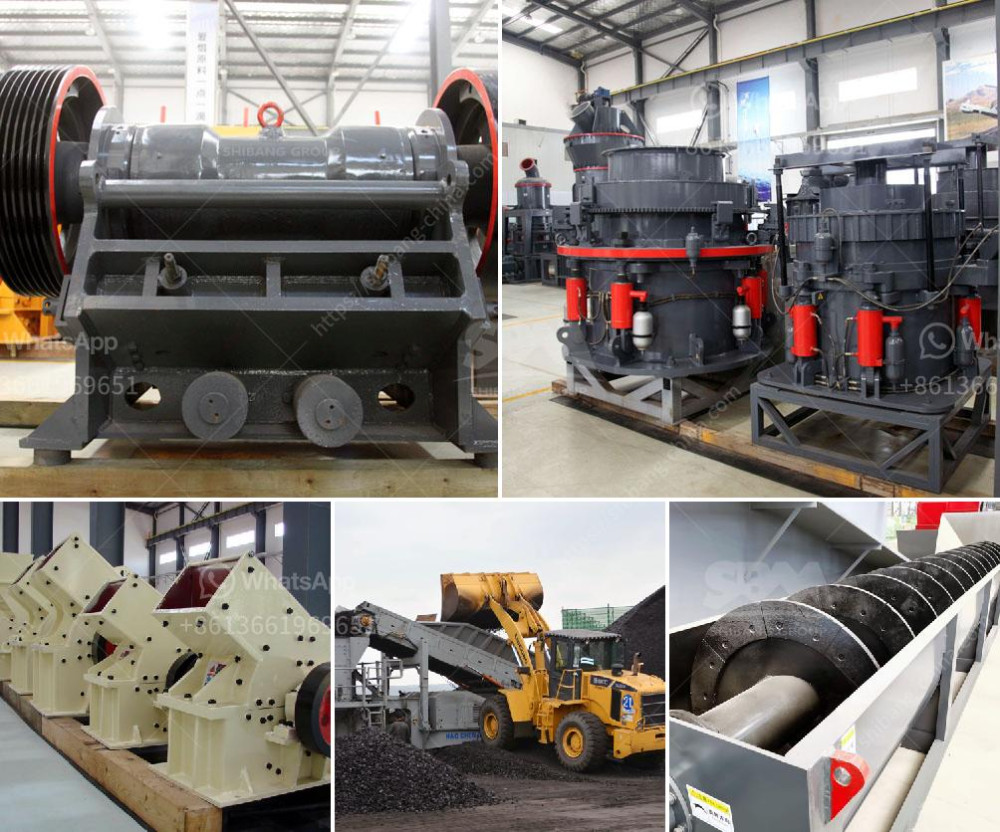

<h3>dolomite crusher manufacturer in nagpur</h3>
Dolomite is a mineral that is commonly found in the Dolomite Mountains. It is a sedimentary rock, which primarily consists of the mineral dolomite along with other minerals such as calcite, aragonite, and magnesite. Dolomite is highly valued for its use in various industries due to its alkaline properties and ability to neutralize acidity.

One of the most common uses of dolomite is in the production of cement and concrete. It is used as a filler material to provide strength and stability to the structure. In addition, dolomite is also used in the manufacturing of glass, ceramics, and steel. It provides the necessary flux in glass production and acts as a sintering agent in steel manufacturing.

To meet the growing demand for dolomite in various industries, there are several dolomite crusher manufacturers in Nagpur. These manufacturers cater to the widespread demand for dolomite by providing high-quality crushers that are specifically designed for crushing dolomite rocks. With their expertise in the field, these manufacturers are able to produce crushers that are robust, efficient, and suitable for heavy-duty applications.

The dolomite crusher manufacturers in Nagpur have been providing excellent services to their customers for several years. They offer a wide range of crushers to suit the needs of their clients. These crushers are designed using high-quality materials and advanced technology to ensure durability and efficiency.

The dolomite crusher manufacturers in Nagpur also take various measures to ensure that the crushers are properly maintained and serviced. They conduct regular inspections, cleanings, and lubrications to prolong the lifespan of the crushers and ensure optimal performance. Additionally, these manufacturers provide comprehensive after-sales services, including spare parts availability and technical support.

Apart from manufacturing crushers, these dolomite crusher manufacturers in Nagpur also assist their customers in selecting the right crusher for their specific requirements. They have a team of experienced professionals who understand the diverse needs of different industries. They provide valuable insights and recommendations to help their clients make informed decisions.

The dolomite crusher manufacturers in Nagpur also prioritize environmental sustainability in their operations. They adhere to strict environmental regulations and work towards minimizing their carbon footprint. The crushers manufactured by these companies are designed to consume less energy and produce minimal emissions, thus reducing their impact on the environment.

In conclusion, the dolomite crusher manufacturers in Nagpur play a crucial role in the production of dolomite for various industries. Their high-quality crushers and excellent services have made them reliable partners for businesses in need of dolomite crushing solutions. These manufacturers continue to innovate and improve their products and processes to meet the evolving needs of their customers.
<h3>Contact us</h3><ul><li><strong>Whatsapp:&nbsp;<a href="https://wa.me/8613661969651">+8613661969651</a></strong></li><li><a href="https://swt.shibang-china.com/?git&amp;zhl&amp;dolomite crusher manufacturer in nagpur"><strong>Online Service(chat now)</strong></a></li></ul><h3>Related</h3><ul><li><a href='cement plant drawings pdf.md'>cement plant drawings pdf</a></li><li><a href='feasibility study for coal mining.md'>feasibility study for coal mining</a></li><li><a href='micro powder grinding mill scm series.md'>micro powder grinding mill scm series</a></li><li><a href='grinding mill for quartz in india.md'>grinding mill for quartz in india</a></li><li><a href='simple formula for belt conveyor counter weight.md'>simple formula for belt conveyor counter weight</a></li></ul>