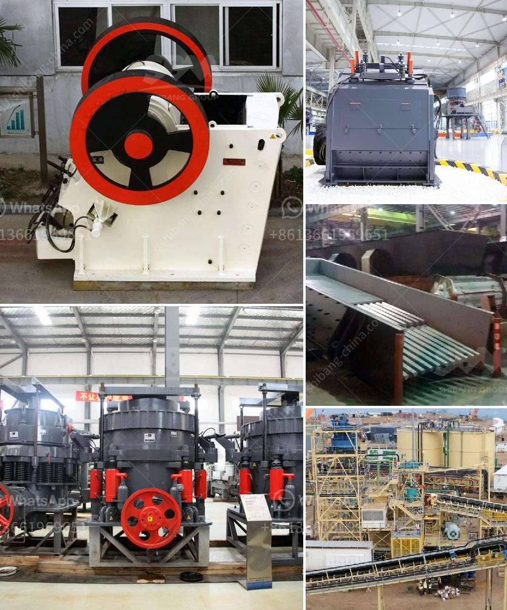

<h3>dolomite crusher plant in kuwait</h3>
Dolomite, a widely occurring mineral compound, has been recognized as one of nature's most versatile materials. The mining industry is experiencing significant growth, primarily due to the increasing demand for dolomite used for various applications, including construction materials, agriculture, and water treatment. In Kuwait, the dolomite crusher plant has been established to crush high-quality dolomite extracted from local mines and ensure their availability for various industries.

The dolomite crusher plant in Kuwait is designed in a way to bring together raw materials, process them efficiently, and provide an end product of exceptional quality. The materials used in the plant consist of feed bins, conveyors, crushers, vibrating screens, and other equipment. Each component plays a crucial role in the overall functioning of the plant.

The process of dolomite crushing involves several stages. First, large dolomite stones are extracted from the mines and loaded onto trucks or conveyors for transportation to the crusher plant. Depending on the size of the dolomite particles, it may be necessary to pre-crush them in a primary crusher to reduce their size before they can be further processed.

Once the dolomite stones reach the plant, they are fed into vibrating feeders, which evenly distribute them to the jaw crusher for primary crushing. The crushed dolomite is then transported by belt conveyors to the secondary crusher for further processing. After being crushed into desired sizes, the dolomite is separated by vibrating screens into different grades according to their size specifications.

The final products from the dolomite crusher plant in Kuwait are mainly used for road and building construction purposes. They include various sizes of gravel, crushed stone, and sand, which are widely used in concrete production, asphalt mixtures, and other construction materials. Additionally, dolomite is used as a soil conditioner in agriculture and as a component in water treatment processes.

The dolomite crusher plant in Kuwait is not only a valuable asset to the construction industry but also provides employment opportunities for local communities. The operation of the plant requires skilled labor, technicians, and engineers, contributing to the economic growth of the region. Moreover, the availability of high-quality dolomite locally reduces dependency on imports, making it a cost-effective solution for Kuwait's infrastructure development.

As with any mining operation, the dolomite crusher plant in Kuwait prioritizes safety and environmental sustainability. Strict compliance with safety regulations and environmentally-friendly practices ensure that the operation has minimal impact on the surroundings. Measures are taken to mitigate dust emissions, noise pollution, and any potential risks associated with the crushing and transportation processes.

In conclusion, the dolomite crusher plant in Kuwait plays a crucial role in supplying high-quality dolomite to various industries. Its efficient operation, skilled workforce, and commitment to safety and sustainability contribute to the overall development and growth of the region. With the increasing demand for dolomite, the crusher plant is expected to continue playing a vital role in meeting Kuwait's infrastructure needs and supporting economic activities.
<h3>Contact us</h3><ul><li><strong>Whatsapp:&nbsp;<a href="https://wa.me/8613661969651">+8613661969651</a></strong></li><li><a href="https://swt.shibang-china.com/?git&amp;zhl&amp;dolomite crusher plant in kuwait"><strong>Online Service(chat now)</strong></a></li></ul><h3>Related</h3><ul><li><a href='quarry equipment prices.md'>quarry equipment prices</a></li><li><a href='kaolin separate beneficiation of iron.md'>kaolin separate beneficiation of iron</a></li><li><a href='crushing roller mill japan.md'>crushing roller mill japan</a></li><li><a href='stone crusher price list.md'>stone crusher price list</a></li><li><a href='crusher prices in kenya.md'>crusher prices in kenya</a></li></ul>