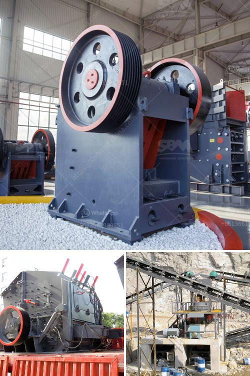

<h3>dolomite crusher plant in malaysia</h3>
Dolomite is a carbonate mineral, mainly composed of calcium magnesium carbonate (CaMg(CO3)2). Dolomite is used as an ornamental stone, a concrete aggregate, and a source of magnesium oxide, as well as in the Pidgeon process for the production of magnesium. It is an important petroleum reservoir rock, and serves as the host rock for large strata-bound Mississippi Valley-Type (MVT) ore deposits of base metals such as lead, zinc, and copper. Dolomite has significant economic value and therefore its demand is constantly increasing.

The dolomite crusher plant in Malaysia includes jaw crusher, impact crusher, cone crusher, vibrating feeder, vibrating screen, and belt conveyor. It will be damaged if it is handled improperly. In order to guarantee the service life of the dolomite crusher plant, operators need to regularly maintain and repair it.

The dolomite crusher plant in Malaysia is equipped with a feeder and a conveyor, which is used to transfer raw materials to the crusher for processing. During the operation of dolomite crusher plant, a large amount of dust and fine dust will be generated, so the collection and removal of dust and fine dust are very important.

Dust and fine dust collection can be achieved through dust suppression, dust encapsulation, and dust extraction. Dust suppression mainly uses water spray to reduce dust. Dust encapsulation is to cover the conveyor or crusher with a sealing cover to reduce dust escape. Dust extraction is to use a dust collector to suck out dust from the source. These methods are effective in reducing dust pollution and protecting the environment.

In addition to dust removal, regular maintenance of the dolomite crusher plant is also necessary. For example, the jaw plate, side guard plate, and toggle plate of the jaw crusher should be replaced regularly because of their wear. The cone liner, mantle, and concave of the cone crusher should be replaced regularly because of their wear. The vibrating feeder should be inspected regularly to ensure smooth feeding. The vibrating screen should be inspected regularly to ensure normal operation.

Regular inspection and maintenance of the dolomite crusher plant can effectively extend its service life, reduce the failure rate and downtime, and improve the productivity of the dolomite processing plant. Malaysia has many dolomite mines and the production capacity is large. Many companies want to have their own dolomite crusher plant to improve the value of their dolomite production. Aiming at the characteristics of dolomite, Fote Machinery has developed a new type of crusher and designed a complete set of production line to meet the needs of dolomite processing.

In conclusion, the dolomite crusher plant in Malaysia is the necessary equipment in mining industry. It can be divided into primary crusher and secondary crusher according to the crushed materials. It is widely used in many industries such as construction, chemical, mineral processing, and cement, among others. The dolomite crusher plant in Malaysia has helped many businesses meet their production goals and boost efficiency. By properly maintaining the equipment and regularly replacing wearing parts, businesses can ensure smooth production and maximize the value of their dolomite output.
<h3>Contact us</h3><ul><li><strong>Whatsapp:&nbsp;<a href="https://wa.me/8613661969651">+8613661969651</a></strong></li><li><a href="https://swt.shibang-china.com/?git&amp;zhl&amp;dolomite crusher plant in malaysia"><strong>Online Service(chat now)</strong></a></li></ul><h3>Related</h3><ul><li><a href='conveyor belt manufacturers in africa.md'>conveyor belt manufacturers in africa</a></li><li><a href='hot selling coal mine roller crushing plant in india.md'>hot selling coal mine roller crushing plant in india</a></li><li><a href='second hand conveyor belt adelaide.md'>second hand conveyor belt adelaide</a></li><li><a href='gypsum crusher in salalah oman.md'>gypsum crusher in salalah oman</a></li><li><a href='gravel crushing plant.md'>gravel crushing plant</a></li></ul>