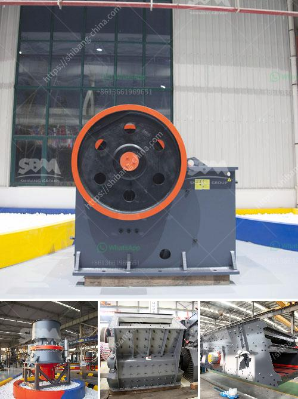

<h3>dolomite crushing plant in bharuch</h3>
Dolomite is a carbonate mineral composed of calcium magnesium carbonate (CaMg(CO3)2). It is one of the raw materials often used in the construction industry and is commonly crushed and used as building materials, road base, and as a filler in asphalt. This versatile mineral has various applications and offers numerous benefits, making it an essential component in various industries.

Bharuch, a city located in the western state of Gujarat, India, has become a prominent place for dolomite crushing plants. The city boasts a favorable location and abundant dolomite mines, making it an ideal destination for establishing dolomite crushing plants. With the rapid growth of infrastructure development and construction activities in the region, the demand for dolomite has surged, leading to an increase in the establishment of crushing plants.

The dolomite crushing plant in Bharuch acts as a vital link in the production of high-quality dolomite flakes. The processing of dolomite involves mining, crushing, and screening. The crushing plant at Bharuch confirms the availability of high-quality dolomite reserves, and it is capable of producing dolomite flakes of various sizes with exceptional accuracy.

The dolomite crushing plant in Bharuch is equipped with modern machines and advanced technological equipment that provide immense benefits to the crushing plant's operation. The plant is also backed by a team of skilled engineers and experienced personnel, ensuring smooth operations and efficient production. With the aid of these resources, the crushing plant is capable of producing large quantities of crushed dolomite, meeting the market demands effectively.

The dolomite crushing plant in Bharuch generates employment opportunities for the local population. This helps in reducing unemployment and serves as a means of livelihood for many individuals, positively impacting the overall socio-economic conditions of the region. The plant also supports other auxiliary industries, such as transportation, logistics, and maintenance services, creating a thriving ecosystem.

Apart from its economic benefits, the dolomite crushing plant in Bharuch promotes sustainable development. The plant adheres to stringent environmental regulations and ensures that its operations do not harm the surrounding environment. Proper waste management practices and effective dust suppression techniques are implemented, minimizing the plant's environmental footprint. Additionally, the plant uses energy-efficient machinery and endeavors to reduce energy consumption, helping in the conservation of natural resources.

The availability of high-quality dolomite flakes from the crushing plant in Bharuch contributes to the region's growth and development. The construction industry benefits greatly from the consistent supply of these flakes, as dolomite acts as an excellent aggregate for concrete and as a base material for road construction. The durability and strength offered by dolomite ensure the longevity of structures, thus contributing to sustainable infrastructure development.

In conclusion, the dolomite crushing plant in Bharuch plays a vital role in meeting the demands of the construction industry. With its efficient operations, sustainable practices, and high-quality dolomite flakes, the plant serves as a gateway to prosperity for the region. The establishment of more such crushing plants in Bharuch will further enhance its capability to cater to the growing demands, fostering economic growth, and improving the overall quality of life.
<h3>Contact us</h3><ul><li><strong>Whatsapp:&nbsp;<a href="https://wa.me/8613661969651">+8613661969651</a></strong></li><li><a href="https://swt.shibang-china.com/?git&amp;zhl&amp;dolomite crushing plant in bharuch"><strong>Online Service(chat now)</strong></a></li></ul><h3>Related</h3><ul><li><a href='mobile stone crusher for sale in philippines.md'>mobile stone crusher for sale in philippines</a></li><li><a href='stone portable crusher.md'>stone portable crusher</a></li><li><a href='mill to pulverize stone crusher.md'>mill to pulverize stone crusher</a></li><li><a href='project report of dolomite powder plant.md'>project report of dolomite powder plant</a></li><li><a href='conventional hammer mill.md'>conventional hammer mill</a></li></ul>