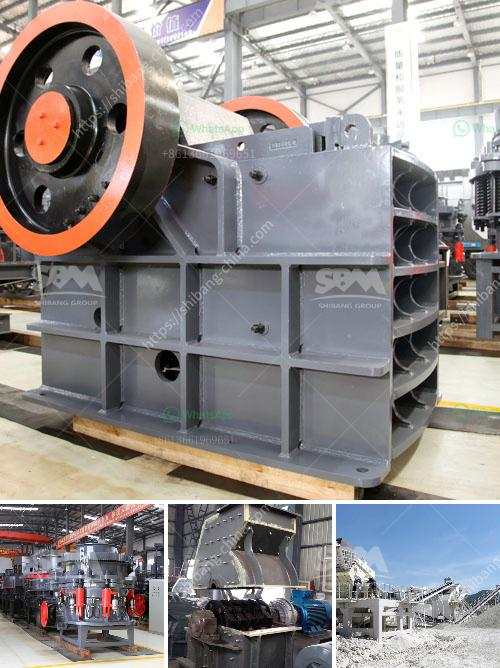

<h3>dolomite crushing plant price in india</h3>
With the natural resource dolomite, a dolomite crushing plant is indispensable for many industries. However, because dolomite may contain impurities, the price fluctuates, making it difficult to estimate the final cost of a dolomite crushing plant. There are many factors contributing to the price of dolomite crushing plants in India, including labor costs, production costs, marketing costs, and equipment costs. Regardless of the specific reasons, it is believed that dolomite crushing plants are increasingly sought after in India.

Dolomite, as a natural resource, has various industrial uses. It is primarily used in the construction industry as a raw material for producing cement and concrete. Additionally, it is used in the production of steel, glass, and ceramics. Dolomite is also widely used in agriculture as an important source of magnesium, which aids in plant growth. It acts as a soil conditioner, neutralizing acidic soils and improving water penetration.

One of the key factors affecting the price of dolomite crushing plants in India is the labor cost. Labor-intensive industries tend to have higher production costs due to the involvement of manual labor. Dolomite crushing plants often require operators to monitor and control the entire process manually. This increases labor costs, thereby influencing the final price of the product.

Production costs are another significant factor. The cost of extracting dolomite from mines is a major component that affects the overall production cost. Additionally, transportation costs from the mines to the crushing plants must also be considered. The availability of skilled labor, equipment maintenance, and energy costs during the production process also contribute to the final price of the dolomite crushing plant.

Another factor affecting the price is marketing costs. Companies invest substantial amounts to promote and distribute their products. Dolomite crushing plant manufacturers must take into account various marketing expenses, including advertising, sales promotions, and distribution costs. These costs are ultimately passed on to the customers, adding to the final price of the product.

Furthermore, the cost of equipment is essential in determining the price of dolomite crushing plants. Equipment costs depend on the capacity, efficiency, and quality of the crushing plant. Higher capacity plants tend to have higher prices due to the increased production capabilities. Similarly, more advanced and efficient equipment comes at a higher cost but offers better operational performance and lower overall running costs.

Considering the numerous factors influencing the price of dolomite crushing plants in India, it is crucial for potential buyers to research and compare prices from different manufacturers. This ensures they get the best value for their investment. Additionally, buyers should consider the quality of the machinery, the after-sales service, and the reliability of the manufacturer before finalizing their purchase decision.

Investing in a dolomite crushing plant in India can be a wise decision for businesses in the construction, mining, and agricultural sectors. By enabling the production of essential materials, it not only contributes to the growth of various industries but also enhances agricultural productivity. With all the factors affecting the price, it is important to carefully evaluate and determine the most suitable dolomite crushing plant for individual needs and budget constraints.
<h3>Contact us</h3><ul><li><strong>Whatsapp:&nbsp;<a href="https://wa.me/8613661969651">+8613661969651</a></strong></li><li><a href="https://swt.shibang-china.com/?git&amp;zhl&amp;dolomite crushing plant price in india"><strong>Online Service(chat now)</strong></a></li></ul><h3>Related</h3><ul><li><a href='crusher plant dolomite.md'>crusher plant dolomite</a></li><li><a href='mining and quarry machines manifactures.md'>mining and quarry machines manifactures</a></li><li><a href='ball mill how to grind mineral.md'>ball mill how to grind mineral</a></li><li><a href='quarry plant making machine for sale in zimbabwe.md'>quarry plant making machine for sale in zimbabwe</a></li><li><a href='portable concrete crushers.md'>portable concrete crushers</a></li></ul>