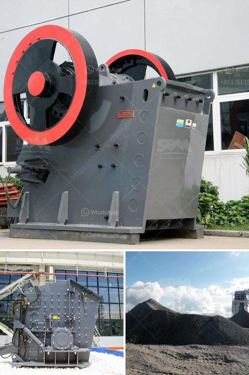

<h3>dolomite grinding roller mill manufacturers india</h3>
Dolomite is a natural mineral composed of calcium magnesium carbonate. It is commonly used as a filler material in the paint, ceramics, and rubber industries. It is also used in the production of building materials such as cement, bricks, and tiles. To meet the growing demand for dolomite, manufacturers in India have been investing in advanced grinding roller mill technologies.

Grinding roller mill is a kind of advanced mill equipment, which is suitable for grinding dolomite, marble, limestone, barite, talc, gypsum, and other mineral powders. This equipment has many advantages, such as high grinding efficiency, low power consumption, large feed size, easy adjustment of product fineness, simple equipment process, and low noise pollution.

In India, there are several renowned dolomite grinding roller mill manufacturers who have been producing and supplying efficient grinding mills for various industries. These manufacturers provide a wide range of dolomite grinding roller mills, including Raymond mill, vertical roller mill, ultrafine grinding mill, medium-speed grinding mill, and other equipment.

These manufacturers can produce high-quality dolomite powder grinding roller mills for different industries, such as dolomite powder manufacturing for glass, ceramics, agriculture, coating, construction, chemical engineering, metallurgy, and other industries. The dolomite grinding roller mill manufacturers in India have been delivering these units to their overseas buyers for several years and have provided customized dolomite grinding solutions to specific user requirements.

India is a country rich in mineral resources, with a large amount of dolomite reserves. It is estimated that there are more than 300 million tons of dolomite deposits in India. Dolomite has been widely used in various industries due to its excellent physical and chemical properties. The demand for dolomite in India and the international market is growing, and manufacturers are constantly seeking innovative grinding solutions to meet the market demand.

The grinding roller mill manufacturers in India are continuously upgrading their technology to better meet the increasing demand for fine and ultrafine dolomite powders. With advanced grinding roller mill technologies, these manufacturers are able to produce high-quality dolomite powders with fine particle sizes and excellent chemical compositions.

In addition to dolomite grinding roller mills, these manufacturers also provide turnkey solutions for dolomite grinding projects, including dolomite processing flow design, installation guidance, operation training, and after-sales service. This ensures that their customers can quickly and efficiently set up dolomite grinding production lines and start producing high-quality dolomite powders.

To conclude, the dolomite grinding roller mill manufacturers in India have been offering efficient dolomite grinding solutions to the industry for several years. These manufacturers understand the evolving needs of the industry and provide customized grinding solutions to meet specific user requirements. With their advanced technologies and reliable equipment, they have been satisfying both Indian and international customers with high-quality dolomite powders. The continuous upgrades and innovations in their grinding technologies ensure that they will remain the preferred choice for dolomite grinding roller mill manufacturers in India.
<h3>Contact us</h3><ul><li><strong>Whatsapp:&nbsp;<a href="https://wa.me/8613661969651">+8613661969651</a></strong></li><li><a href="https://swt.shibang-china.com/?git&amp;zhl&amp;dolomite grinding roller mill manufacturers india"><strong>Online Service(chat now)</strong></a></li></ul><h3>Related</h3><ul><li><a href='metals alloys for ball mill.md'>metals alloys for ball mill</a></li><li><a href='high energy ball mill india.md'>high energy ball mill india</a></li><li><a href='hammer mill for limestone in south africa.md'>hammer mill for limestone in south africa</a></li><li><a href='hot selling coal mine roller crushing plant in india.md'>hot selling coal mine roller crushing plant in india</a></li><li><a href='ball mill installation.md'>ball mill installation</a></li></ul>