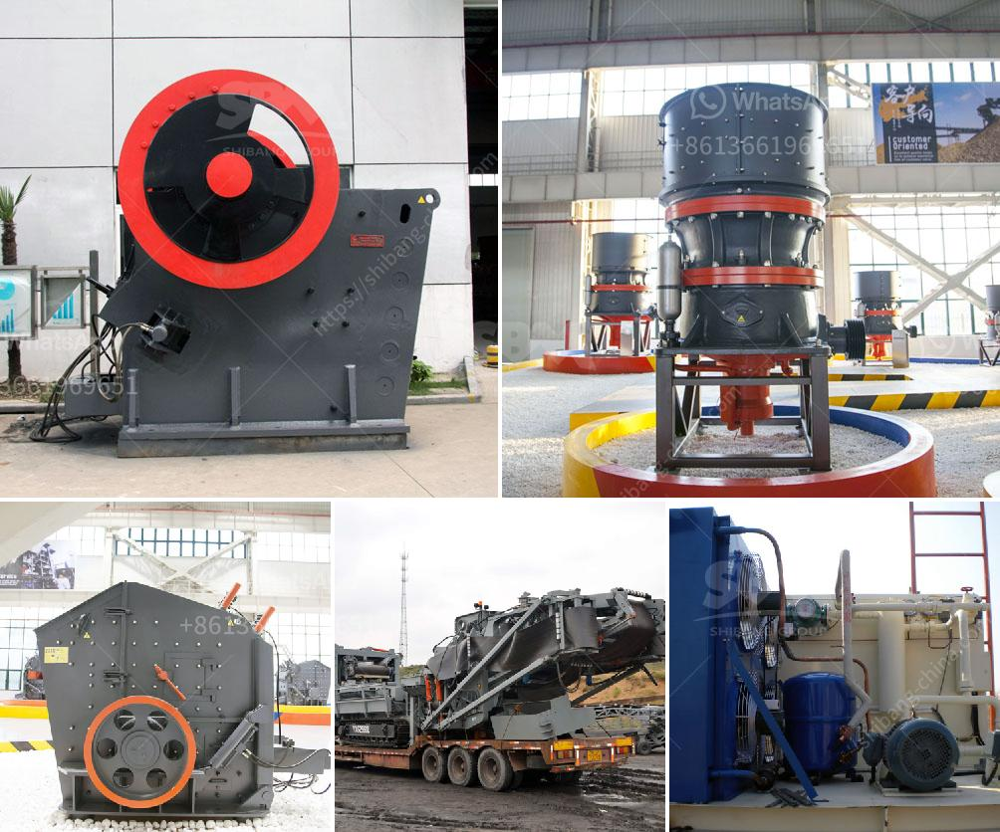

<h3>dolomite lime process for agriculure</h3>
Dolomite lime, a type of agricultural lime, is a soil conditioner made from crushed limestone. It contains both minerals, calcium, and magnesium, which are essential for optimal plant growth. The dolomite lime process for agriculture involves several steps to ensure proper application and effectiveness.

The first step in the dolomite lime process is to quarry the limestone. Limestone is extracted from the earth's crust through blasting or excavation methods. The quality and grade of the limestone determine its suitability for use as dolomite lime.

Once the limestone has been quarried, it is then crushed into smaller pieces. The crushing process ensures that the limestone particles are of an appropriate size for agricultural use. The crushed limestone is then further processed to remove impurities and enhance its quality.

The next step in the dolomite lime process is calcination. Calcination is a heating process that converts limestone into a more reactive form of lime called quicklime. Calcination removes carbon dioxide from the limestone, leaving behind calcium oxide or quicklime. This process increases the availability of calcium and magnesium in the lime, making it more beneficial for soil enrichment.

After calcination, the quicklime is hydrated to form hydrated lime or slaked lime. Hydration involves adding water to the quicklime, which results in the formation of calcium hydroxide. This hydrated lime is then carefully ground into a fine powder.

The final step in the dolomite lime process for agriculture is the application of the lime to the soil. Dolomite lime can be spread on the soil's surface or incorporated into the soil through tilling or plowing. The lime reacts with the soil to neutralize acidity, raise the pH level, and improve soil structure.

The addition of dolomite lime to agricultural soils provides several benefits. It improves nutrient availability, enhances plant root development, and promotes healthy microbial activity. Additionally, dolomite lime can prevent nutrient imbalances and deficiencies, ultimately leading to higher yields and better crop quality.

In conclusion, the dolomite lime process for agriculture involves quarrying, crushing, calcination, hydration, and application. This process ensures that the dolomite lime is of high quality and can effectively enhance soil conditions. By incorporating dolomite lime into agricultural practices, farmers can improve soil health, promote robust plant growth, and achieve better crop yields.
<h3>Contact us</h3><ul><li><strong>Whatsapp:&nbsp;<a href="https://wa.me/8613661969651">+8613661969651</a></strong></li><li><a href="https://swt.shibang-china.com/?git&amp;zhl&amp;dolomite lime process for agriculure"><strong>Online Service(chat now)</strong></a></li></ul><h3>Related</h3><ul><li><a href='calcium carbonate grinding plant.md'>calcium carbonate grinding plant</a></li><li><a href='ball mills for cement grinding.md'>ball mills for cement grinding</a></li><li><a href='brick crusher line production.md'>brick crusher line production</a></li><li><a href='price jaw crusher pdf.md'>price jaw crusher pdf</a></li><li><a href='marble production line germany.md'>marble production line germany</a></li></ul>