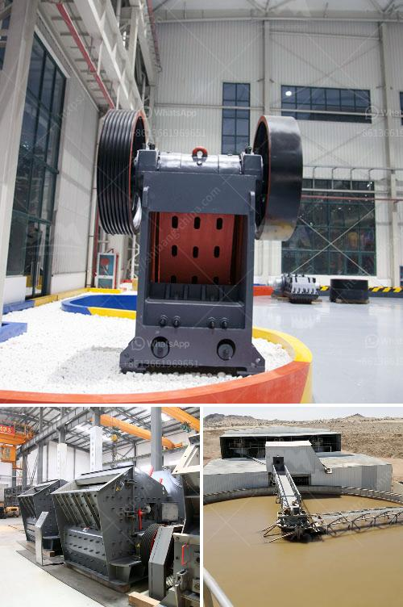

<h3>dolomite powder making</h3>
Dolomite is a mineral that has gained significant popularity in recent years due to its wide range of applications. The versatility of dolomite makes it a valuable resource in various industries, including construction, agriculture, and manufacturing. Dolomite powder, made from finely ground dolomite, serves as an excellent filler material in many products and industrial processes. In this article, we will explore the key steps involved in dolomite powder making.

1. Mining Dolomite: The first step in dolomite powder making is to mine the dolomite rocks. Depending on the location and quality of the dolomite deposit, mining operations may involve blasting, crushing, and transportation of the raw material. After extraction, dolomite rocks are crushed to a suitable size for further processing.

2. Grinding: The next step in dolomite powder making is grinding the crushed dolomite rocks into fine particles. Depending on the desired particle size, various grinding techniques can be used. Ball mills, vibrating mills, and roller mills are commonly used for this purpose. These grinding mills reduce the dolomite rocks to a fine powder, ensuring uniform particle size distribution.

3. Classifying: After the grinding process, the dolomite powder is passed through a classifier to remove any oversized particles and obtain a consistent particle size. The classification process ensures that the final product meets the desired specifications.

4. Drying: In some cases, dolomite powder may contain moisture that needs to be removed before further processing. The drying process involves using high-temperature air or a drying agent to evaporate the moisture. This step is crucial to prevent clumping and ensure the free-flowing nature of the powder.

5. Post-Treatment: Depending on the intended use of the dolomite powder, additional post-treatment may be required. For example, in the construction industry, dolomite powder is often mixed with cement or concrete to enhance their properties. In the agricultural sector, dolomite powder can be processed further to produce micronized dolomite, which is used as a soil conditioner.

6. Packaging: Once the dolomite powder has been processed and treated, it is ready for packaging. Proper packaging ensures the preservation of the powder's quality and prevents any contamination or moisture absorption. Packaging materials may include bags, bulk containers, or even specialized packaging suitable for specific industries.

Dolomite powder, with its wide range of applications, continues to be in high demand. Industries such as ceramics, glass, plastics, and rubber heavily rely on dolomite powder as a filler material. In construction, dolomite powder can be used in various forms, including as a base for roads, as an ingredient in asphalt and concrete mixtures, and as a component in building materials.

In conclusion, dolomite powder making involves a series of steps, starting from mining and crushing the raw material, followed by grinding, classifying, drying, and post-treatment. The end product is a fine powder that finds applications in diverse industries. Dolomite powder's versatility and wide range of uses make it an essential resource in the global economy.
<h3>Contact us</h3><ul><li><strong>Whatsapp:&nbsp;<a href="https://wa.me/8613661969651">+8613661969651</a></strong></li><li><a href="https://swt.shibang-china.com/?git&amp;zhl&amp;dolomite powder making"><strong>Online Service(chat now)</strong></a></li></ul><h3>Related</h3><ul><li><a href='cement mill plants.md'>cement mill plants</a></li><li><a href='gypsum powder production plants.md'>gypsum powder production plants</a></li><li><a href='used sand washing machine for sale.md'>used sand washing machine for sale</a></li><li><a href='sizing jaw crusher.md'>sizing jaw crusher</a></li><li><a href='conveyor belts in france.md'>conveyor belts in france</a></li></ul>