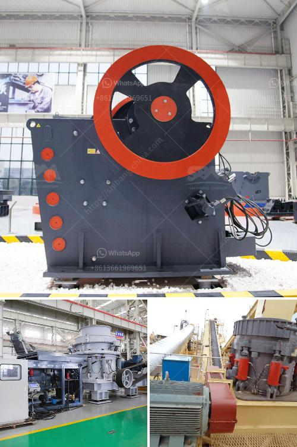

<h3>dolomite processing plant</h3>
Dolomite is a mineral found in sedimentary rocks, which is mainly composed of calcium magnesium carbonate. The mineral has been widely used in various industries, such as construction, ceramics, glass, refractory materials, and agriculture. Dolomite processing plants are used to transform the mineral into usable products for various industries.

The process of dolomite processing plant usually involves crushing, grinding, and screening. Crushing involves the crushing of the ore to a size that can be easily handled, such as 10mm or 20mm. Grinding involves the further reduction of the crushed ore to a fine powder using a grinder mill. Screening involves the separation of the ground ore into various sizes, such as 0-5mm, 5-10mm, 10-20mm, and 20-40mm.

One of the main challenges in dolomite processing plants is the presence of impurities, such as iron and aluminum oxides, which can affect the quality of the final product. To remove these impurities, various techniques can be used, such as magnetic separation, flotation, and gravity separation. Magnetic separation involves the use of magnets to separate the magnetic impurities from the non-magnetic dolomite. Flotation involves the use of chemicals to selectively separate the impurities from the dolomite. Gravity separation involves the use of gravity to separate the different components of the ore based on their density.

Once the impurities are removed, the dolomite can be further processed into various products. In the construction industry, dolomite is often used as a substitute for limestone in the production of cement. Dolomite cement is known for its high strength and durability, making it suitable for various construction applications. In the ceramics industry, dolomite is used as a raw material for the production of ceramics tiles and sanitary ware. Dolomite ceramics are known for their high strength, low porosity, and excellent chemical resistance.

In the glass industry, dolomite is used as a flux to lower the melting temperature of the glass and improve its chemical durability. Dolomite is also used as a filler in the production of refractory materials, which are used in the lining of furnaces and kilns. Dolomite refractory materials are known for their high heat resistance and excellent mechanical properties.

In the agriculture industry, dolomite is often used as a soil conditioner to raise the pH of acidic soils and improve the availability of essential nutrients to plants. Dolomite can also be used as an ingredient in fertilizer formulations, providing calcium and magnesium to the plants. The use of dolomite in agriculture can help improve crop yield and quality.

In conclusion, dolomite processing plants play a crucial role in transforming the mineral into usable products for various industries. The process involves crushing, grinding, and screening to remove impurities and obtain the desired particle size. Dolomite is widely used in construction, ceramics, glass, refractory materials, and agriculture, providing strength, durability, and chemical resistance to the final products. With the increasing demand for these industries, the importance of efficient dolomite processing plants is on the rise.
<h3>Contact us</h3><ul><li><strong>Whatsapp:&nbsp;<a href="https://wa.me/8613661969651">+8613661969651</a></strong></li><li><a href="https://swt.shibang-china.com/?git&amp;zhl&amp;dolomite processing plant"><strong>Online Service(chat now)</strong></a></li></ul><h3>Related</h3><ul><li><a href='roll crusher used equipment.md'>roll crusher used equipment</a></li><li><a href='2000 kilos hammer mill.md'>2000 kilos hammer mill</a></li><li><a href='dolomite crusher manufacturer in nagpur.md'>dolomite crusher manufacturer in nagpur</a></li><li><a href='how to find startup funding for a stone crushing business.md'>how to find startup funding for a stone crushing business</a></li><li><a href='small rock crusher for small scale aggregate producers.md'>small rock crusher for small scale aggregate producers</a></li></ul>