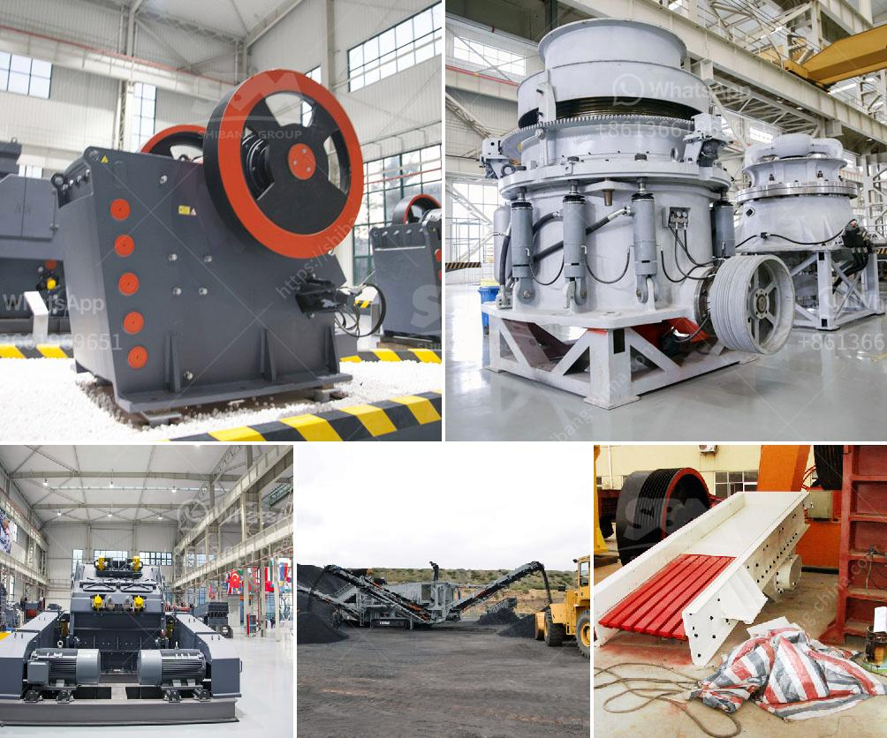

<h3>dolomite roller mill</h3>
Dolomite is a natural mineral that is commonly used in limestone form, making it suitable for construction and industrial applications. With its versatile properties, it has become a popular material in various industries. One of the most efficient and advanced methods to process dolomite is through the use of a dolomite roller mill.

A dolomite roller mill is a device that enables the grinding and crushing of dolomite minerals into a fine powder. This process helps to break down the larger particles into smaller, more usable size, thus increasing the surface area for better absorption by various industries. The roller mill utilizes a set of rollers that spin at high speed to grind and crush the dolomite, ensuring its uniformity and fineness.

One major advantage of using a dolomite roller mill is its versatility. It can accommodate various feed sizes and handle different levels of hardness. This makes it suitable for a wide range of applications, from agriculture and construction to paint and paper production. The roller mill's adjustable grinding gap also allows for customizable output sizes, ensuring that the dolomite powder meets specific product requirements.

Another significant benefit of a dolomite roller mill is its energy efficiency. The roller mill's design minimizes energy consumption, making it an eco-friendly option for processing dolomite. This reduces the environmental impact and lowers operational costs for industries using this technology.

Moreover, a dolomite roller mill offers high productivity due to its design and construction. The roller mill's robust mechanism ensures continuous operation, minimizing downtime and maximizing production output. Its automated features, such as adjustable feed rate and grinding pressure, further optimize the milling process, increasing productivity.

In conclusion, a dolomite roller mill is an efficient and advanced method for processing dolomite minerals. Its versatility, energy efficiency, and high productivity make it a preferred choice for industries across various sectors. With its ability to produce finely ground dolomite powder, this technology contributes to the production of high-quality materials for multiple applications.
<h3>Contact us</h3><ul><li><strong>Whatsapp:&nbsp;<a href="https://wa.me/8613661969651">+8613661969651</a></strong></li><li><a href="https://swt.shibang-china.com/?git&amp;zhl&amp;dolomite roller mill"><strong>Online Service(chat now)</strong></a></li></ul><h3>Related</h3><ul><li><a href='china roller mill.md'>china roller mill</a></li><li><a href='vsi crusher suppliers in europe.md'>vsi crusher suppliers in europe</a></li><li><a href='aggregates crushing flow chart process.md'>aggregates crushing flow chart process</a></li><li><a href='cement clinker plant machinery hyderabad.md'>cement clinker plant machinery hyderabad</a></li><li><a href='chrome ore price in south africa.md'>chrome ore price in south africa</a></li></ul>