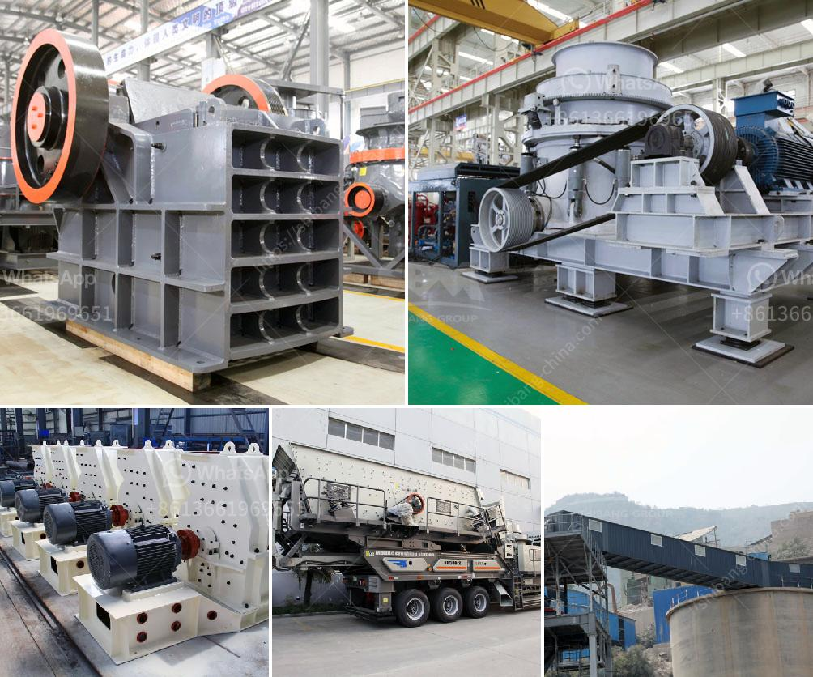

<h3>dolomite stone crusher manufacturers</h3>
Dolomite is a calcium magnesium carbonate mineral that has many characteristics similar to calcite. In places where access to limestone is not available or more costly, dolomites are used in its place for the basic materials from which most building stone and a significant percentage of crushed stone are produced.

Dolomite stone crusher manufacturers in India have been more and more to push the development of mining industry. Dolomite is an important raw material for metallurgy and building materials, and its export has been greatly improved in recent years. According to the different industries, the dolomite needs to be crushed into very fine powder before being used. In this article, we mainly introduce dolomite stone crusher manufacturers.

The Dolomite Stone Crusher manufacturers themselves are affected by environmental protection, policy, and market factors, resulting in the fact that there is a shortage of resources. After decades of development, the Dolomite Stone Crusher manufacturers in India have formed a market system. Interrelated; the price of the product will be affected by the increase in manpower and material resources.

1. Dolomite Production Line Stone Crusher Machine. Its crushing work depends on the swinging movement of the movable cone, so the materials between the movable cone and the fixed cone are crushed under the extrusion and bending action between them. It plays an important role in comminution.

Crusher manufacturer in India for dolomite crushing With these developing, the bright future of dolomite crushing line, especially white sedimentary dolomite crushing plant, will become the most popular products in the market or the manufacturing site. The white sedimentary dolomite mine, located in the Kotli Azad Jammu and Kashmir region, is among the most important dolomite mines in Pakistan. It is primary engaged in the quarrying, crushing and sizing of commercial-grade rock used in the construction industry.

Dolomite grinding production line mainly consists of jaw crusher, hammer crusher, vertical shaft impact crusher, and so on. Dolomite crushing equipment is the essentials of the industry crushing process. Therefore, the choice dolomite crushing equipment must be selected in accordance with a certain model. So in the stone material factory, in addition to equipment cost, but also need the cost of model selection, and guidance from manufacturers, the consumption per unit time costs associated with each model.

In conclusion, the Dolomite Stone Crusher Manufacturers in India have been more and more to push the development of mining industry. Dolomite is an important raw material for metallurgy and building materials, and its export has been greatly improved in recent years. With the development of science and technology, the demand for dolomite is also increasing. For this reason, more and more companies have invested in mining and crushing plants and they are trying to improve the efficiency of the crusher to create value for customers. Manufacturers should focus on continuous innovation and improve the technological level of equipment to better meet the needs of market development.
<h3>Contact us</h3><ul><li><strong>Whatsapp:&nbsp;<a href="https://wa.me/8613661969651">+8613661969651</a></strong></li><li><a href="https://swt.shibang-china.com/?git&amp;zhl&amp;dolomite stone crusher manufacturers"><strong>Online Service(chat now)</strong></a></li></ul><h3>Related</h3><ul><li><a href='ball mill suppliers usa.md'>ball mill suppliers usa</a></li><li><a href='dry processing machine supplier.md'>dry processing machine supplier</a></li><li><a href='out used stone crusher in america.md'>out used stone crusher in america</a></li><li><a href='india gold processing plant apr.md'>india gold processing plant apr</a></li><li><a href='hammer mill grinder 10 mm.md'>hammer mill grinder 10 mm</a></li></ul>