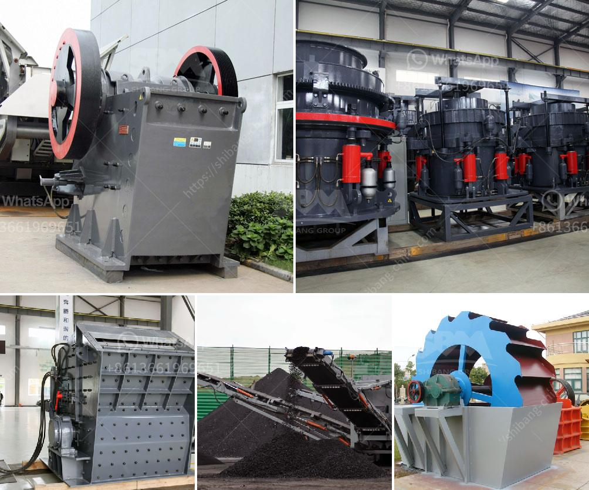

<h3>double rotor hammer crusher</h3>
The double rotor hammer crusher is a versatile and durable machine suitable for fine and medium crushing of brittle materials. The double rotor hammer crusher offers reliable performance and low energy consumption, resulting in a long lifespan and the ability to create a range of particle sizes.

It highlights the strengths of the double rotor hammer crusher and explains why it is an ideal choice for companies with high productivity requirements. The article also touches upon the key features and advantages of the double rotor hammer crusher, making it an informative read for those seeking a reliable and efficient crushing solution.

In the constantly evolving world of industrial equipment, crushers are widely recognized as an essential tool for various applications in mining, construction, and material processing industries. Among the plethora of crusher options available, the double rotor hammer crusher stands out for its unique design and impressive capabilities.

The double rotor hammer crusher combines several advantages into one reliable crushing machine. It is characterized by its ability to carry out intermediate and fine crushing operations. It is particularly well-suited for processing materials with high moisture content or those that tend to adhere to the crusher screens.

The double rotor hammer crusher employs two sets of rotors, each bearing a specially made hammer. The material enters the crushing chamber and is crushed by the impact between the high-speed rotating hammers and the lower impact plates. The crawler-type rotor with high kinetic energy velocity imparts strong crushing force to the material, allowing it to be broken down into required particle sizes efficiently.

Energy efficiency is a significant consideration for industries as they strive to reduce their environmental impact and operational costs. The double rotor hammer crusher stands out in the market for its low energy consumption, making it a preferred choice for companies seeking to improve their efficiency and productivity.

Moreover, the double rotor hammer crusher ensures a uniform particle size distribution with minimal fines generation. This feature allows users to meet specific requirements needed for their application, whether it be in aggregate production, mining, or recycling.

The durability and longevity of the double rotor hammer crusher are commendable. The robust construction and optimal design are engineered to withstand heavy-duty operations, ensuring reliability and extended machine lifespan. The use of high-quality wear-resistant materials for the hammers and impact plates makes the double rotor hammer crusher extremely wear-resistant, reducing downtime and maintenance costs.

Furthermore, the double rotor hammer crusher features a user-friendly design, simplifying maintenance tasks. The hammers and screens can be easily replaced when worn out, maximizing uptime and minimizing disruptions to production schedules.

The double rotor hammer crusher is a versatile and efficient crushing machine widely used in mining, construction, and material processing industries. The benefits and features of the double rotor hammer crusher strengthen its position as the preferred crushing solution for companies seeking to improve their operational efficiency and productivity.

Its ability to handle a wide range of materials and maintain a consistent particle size distribution, coupled with its low energy consumption and ease of maintenance, make the double rotor hammer crusher a highly desirable option in the competitive crusher market.

Investing in a double rotor hammer crusher ensures that businesses can achieve their desired particle size range efficiently while minimizing downtime. With its remarkable durability, this crushing machine is sure to be a valuable asset to businesses, providing reliable and efficient crushing capabilities for years to come.
<h3>Contact us</h3><ul><li><strong>Whatsapp:&nbsp;<a href="https://wa.me/8613661969651">+8613661969651</a></strong></li><li><a href="https://swt.shibang-china.com/?git&amp;zhl&amp;double rotor hammer crusher"><strong>Online Service(chat now)</strong></a></li></ul><h3>Related</h3><ul><li><a href='gypsum powder production plants.md'>gypsum powder production plants</a></li><li><a href='cement formation process.md'>cement formation process</a></li><li><a href='quarry equipment manufacturer.md'>quarry equipment manufacturer</a></li><li><a href='granite crushing machine for sale.md'>granite crushing machine for sale</a></li><li><a href='zhauns south africa price list pdf.md'>zhauns south africa price list pdf</a></li></ul>