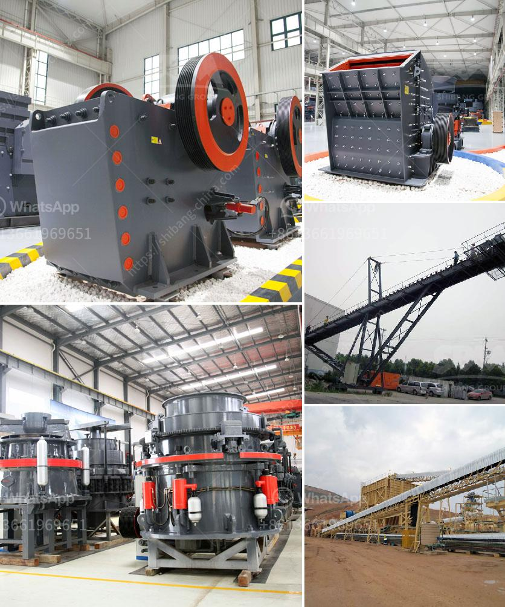

<h3>double toggle jaw crusher advantages</h3>
The double toggle jaw crusher is a commonly used machine in mining and quarrying. It is mainly used for medium-sized crushing of various ores and bulk materials. The benefits of double toggle jaw crusher include:

1. High production capacity: The crushing chamber is deep and has a large crushing ratio. This means the jaw crusher can handle a wide range of materials, including brittle materials, which gives it a higher productivity compared to other crushers.

2. Simple structure and easy maintenance: The double toggle jaw crusher is compact in design and simple to operate. It uses mechanical pressure to crush materials, making it easy to maintain and requiring less maintenance compared to other types of crushers.

3. Reliable and durable construction: The double toggle jaw crusher is designed with heavy-duty components to ensure long-term performance. It is built with materials and parts that are resistant to wear and tear, making it highly reliable and durable in operation.

4. Versatility in applications: The double toggle jaw crusher can be used for crushing a variety of materials, such as rock, limestone, gypsum, coal, granite, basalt, etc. With the different requirements of different crushing applications, it can be used in the mining, metallurgical, building materials, construction, and chemical industries.

5. Energy efficiency: The double toggle jaw crusher has a higher crushing capacity compared to other crushers of similar size. Its lower energy consumption also leads to lower operating costs, reducing the overall production costs.

In conclusion, the double toggle jaw crusher is an essential machine in the mining and quarrying industry. It offers a great combination of efficiency, usability, and durability that makes it a reliable choice for crushing various materials. With its unique advantages, it continues to play a significant role in the crushing industry.
<h3>Contact us</h3><ul><li><strong>Whatsapp:&nbsp;<a href="https://wa.me/8613661969651">+8613661969651</a></strong></li><li><a href="https://swt.shibang-china.com/?git&amp;zhl&amp;double toggle jaw crusher advantages"><strong>Online Service(chat now)</strong></a></li></ul><h3>Related</h3><ul><li><a href='plant of quartz poweder is salling out.md'>plant of quartz poweder is salling out</a></li><li><a href='equipment used in small scale mining in ghana.md'>equipment used in small scale mining in ghana</a></li><li><a href='stone crusher equipments.md'>stone crusher equipments</a></li><li><a href='south africa jaw crushers.md'>south africa jaw crushers</a></li><li><a href='manufacturers of stone crushers in usa.md'>manufacturers of stone crushers in usa</a></li></ul>