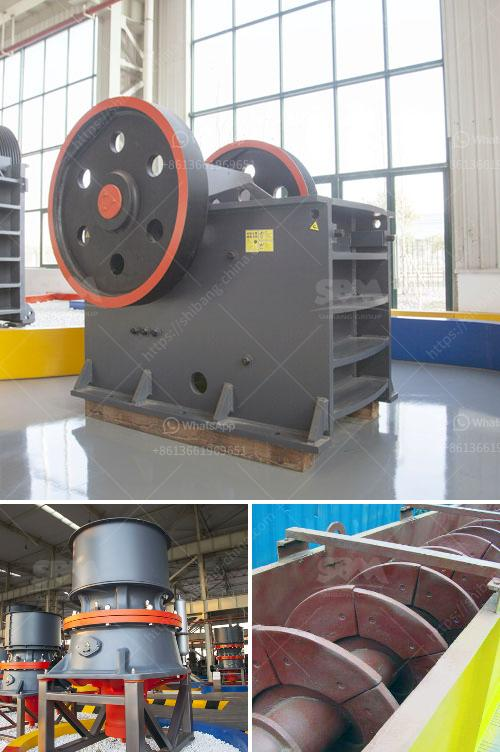

<h3>dry and wet process of cement manufacturing pdf</h3>
The cement manufacturing process is a highly energy-intensive process, with numerous steps and various substances involved. One of the main steps in the cement manufacturing process is the production of clinker. This process involves the transformation of the raw materials into a more reactive material called clinker. The production of clinker is a critical and delicate process that requires precise control and monitoring.

There are two main types of cement manufacturing processes: the dry process and the wet process. The main difference between these two methods of manufacturing cement is the way in which the raw materials are mixed and ground.

In the dry process of cement manufacturing, the raw materials are first crushed into smaller particles. Then, they are dried and ground to a fine powder. This powdered form is then preheated and calcined in a kiln at high temperatures. This process results in the formation of a substance called clinker. The clinker is then cooled and ground again to obtain the final product, cement. The dry process of cement manufacturing is energy-intensive and requires the use of high temperatures, making it less environmentally friendly compared to the wet process.

On the other hand, the wet process of cement manufacturing involves the mixing of raw materials in a slurry form. The raw materials are first crushed and mixed with water to form a slurry. This slurry is then fed into a kiln, where it is heated and dried. The dried slurry is then ground to a fine powder to produce cement. The wet process of cement manufacturing is less energy-intensive and produces less carbon dioxide emissions compared to the dry process. However, it requires a significant amount of water, making it less sustainable in areas with water scarcity.

Both the dry and wet processes of cement manufacturing have their advantages and disadvantages. While the dry process is energy-intensive and generates more carbon dioxide emissions, it requires less water and can be more suitable in areas with water scarcity. On the other hand, the wet process is less energy-intensive and environmentally friendly but requires a significant amount of water.

In conclusion, the cement manufacturing process involves different methods, including the dry and wet processes. The choice between the two methods depends on various factors, such as the availability of water, energy efficiency, and environmental impact. It is essential for cement manufacturers to consider these factors and adopt sustainable practices to minimize the environmental impact of cement manufacturing.
<h3>Contact us</h3><ul><li><strong>Whatsapp:&nbsp;<a href="https://wa.me/8613661969651">+8613661969651</a></strong></li><li><a href="https://swt.shibang-china.com/?git&amp;zhl&amp;dry and wet process of cement manufacturing pdf"><strong>Online Service(chat now)</strong></a></li></ul><h3>Related</h3><ul><li><a href='price list stone crusher machine guangzhou.md'>price list stone crusher machine guangzhou</a></li><li><a href='stone crushing for sale.md'>stone crushing for sale</a></li><li><a href='used crusher stone sale tanzania.md'>used crusher stone sale tanzania</a></li><li><a href='stone crushing machine zimbabwe.md'>stone crushing machine zimbabwe</a></li><li><a href='vsi crusher suppliers in europe.md'>vsi crusher suppliers in europe</a></li></ul>