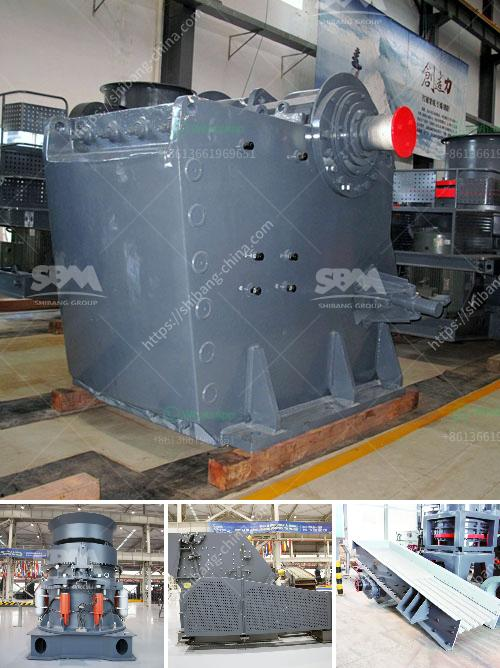

<h3>dry processing machine supplier</h3>
Dry processing machines play a vital role in various industries, including food processing, pharmaceuticals, chemicals, and minerals. These machines are specifically designed to handle bulk materials without the use of water or any other liquid medium. Having a reliable dry processing machine supplier is crucial for businesses looking to achieve efficient and high-quality processing in their operations.

One of the key advantages of using dry processing machines is their ability to preserve the integrity and quality of the materials being processed. Unlike wet processing, where water can alter the characteristics of the materials, dry processing ensures minimal alteration and maintains the original properties of the raw materials. This makes dry processing ideal for industries where material quality is of utmost importance, such as food and pharmaceuticals.

When choosing a dry processing machine supplier, it is essential to consider their expertise and experience in the industry. A reputable supplier should have a comprehensive understanding of the specific requirements and challenges faced by different industries. They should be knowledgeable about the various options available and be able to provide customized solutions that match the unique needs of their clients.

Reliability is another critical factor to consider when selecting a dry processing machine supplier. Downtime can lead to significant losses in productivity and revenue. A reliable supplier will not only offer high-quality machines but also provide prompt technical support and maintenance services. This ensures that any issues or breakdowns are addressed swiftly, minimizing disruptions to the production process.

Efficiency is a key goal for businesses in any industry. A reliable dry processing machine supplier will offer machines that are designed to maximize efficiency and minimize energy consumption. Cutting-edge technologies and innovative designs should be part of their product range, allowing businesses to achieve optimal processing capabilities while reducing operational costs.

In addition to efficiency, customization is essential for businesses with specific processing requirements. A reputable supplier will work closely with their clients to understand their specific needs and provide tailored solutions. They should be able to offer a variety of machine options with different capacities, sizes, and functionalities, ensuring that businesses can choose the most suitable machine for their operations.

When it comes to dry processing machines, quality and safety should never be compromised. A reputable supplier should adhere to strict quality standards and certifications, ensuring that their machines meet or exceed industry regulations. They should also prioritize the safety of their machines, implementing robust safety features and providing comprehensive training and support to users.

Selecting the right dry processing machine supplier is crucial for businesses seeking efficient and high-quality processing. It is essential to choose a supplier with expertise, experience, reliability, and a commitment to delivering customized solutions. By partnering with a reputable supplier, businesses can optimize their processing capabilities, enhance productivity, and maintain the integrity of their materials.
<h3>Contact us</h3><ul><li><strong>Whatsapp:&nbsp;<a href="https://wa.me/8613661969651">+8613661969651</a></strong></li><li><a href="https://swt.shibang-china.com/?git&amp;zhl&amp;dry processing machine supplier"><strong>Online Service(chat now)</strong></a></li></ul><h3>Related</h3><ul><li><a href='manufacturer of quartz powder in india.md'>manufacturer of quartz powder in india</a></li><li><a href='cost per tonne crushing iron ore.md'>cost per tonne crushing iron ore</a></li><li><a href='basalt crushing plant.md'>basalt crushing plant</a></li><li><a href='project proposal on stone crushing mill small scale.md'>project proposal on stone crushing mill small scale</a></li><li><a href='mini cement plant cost in india.md'>mini cement plant cost in india</a></li></ul>