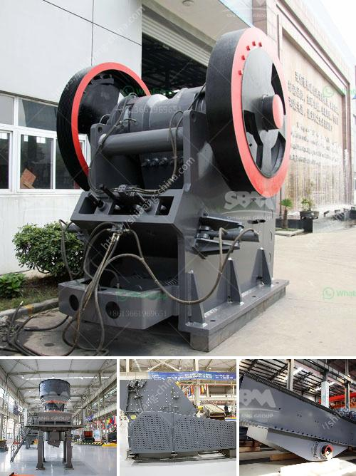

<h3>eagle 1400 crusher for sale</h3>
The Eagle 1400 crusher is an excellent choice for recycling concrete and asphalt materials. This rugged, high-quality machine is capable of producing excellent final products with a high efficiency, making it one of the most popular options out there. If you are in the market for a crusher, this model should definitely be on your radar.

One of the standout features of the Eagle 1400 crusher is its ability to handle a variety of materials. Whether you are working with concrete, asphalt, or other types of materials, this machine can easily process it. This versatility makes it a great investment for construction companies, as it allows them to tackle a wide range of projects with just one machine.

In terms of performance, the Eagle 1400 crusher delivers outstanding results. It features a powerful engine and a state-of-the-art hydraulic system that ensures smooth and efficient operation. With its high capacity and low operational costs, this crusher can help reduce downtime and increase productivity on job sites.

Another advantage of the Eagle 1400 crusher is its mobility. This machine is mounted on a heavy-duty chassis, allowing it to be easily transported from one location to another. Whether you need to move it to a different job site or simply reposition it within your current site, this crusher offers the flexibility and convenience that many contractors demand.

When it comes to maintenance and durability, the Eagle 1400 crusher shines once again. It is built to withstand the toughest conditions and has been proven to deliver long-lasting performance. With regular maintenance and proper care, this machine will continue to operate at peak efficiency for many years to come.

If you are considering purchasing the Eagle 1400 crusher, you will be pleased to know that there are several models available for sale. Whether you prefer to buy new or used, there are options to suit every budget. It is recommended to do some research and compare prices from different sellers to ensure you are getting the best deal possible.

In conclusion, the Eagle 1400 crusher is an exceptional piece of equipment for any construction or recycling project. With its versatility, performance, mobility, and durability, it is not surprising that it has become a popular choice among professionals in the industry. Whether you need to crush concrete or asphalt, this machine will get the job done efficiently and effectively. Consider investing in the Eagle 1400 crusher and see the positive impact it can have on your projects.
<h3>Contact us</h3><ul><li><strong>Whatsapp:&nbsp;<a href="https://wa.me/8613661969651">+8613661969651</a></strong></li><li><a href="https://swt.shibang-china.com/?git&amp;zhl&amp;eagle 1400 crusher for sale"><strong>Online Service(chat now)</strong></a></li></ul><h3>Related</h3><ul><li><a href='cobble stone project in ethiopia.md'>cobble stone project in ethiopia</a></li><li><a href='ball mill suppliers usa.md'>ball mill suppliers usa</a></li><li><a href='hammer mill for sale south africa.md'>hammer mill for sale south africa</a></li><li><a href='limestone processing plant price list.md'>limestone processing plant price list</a></li><li><a href='mineral processing equipment cost.md'>mineral processing equipment cost</a></li></ul>