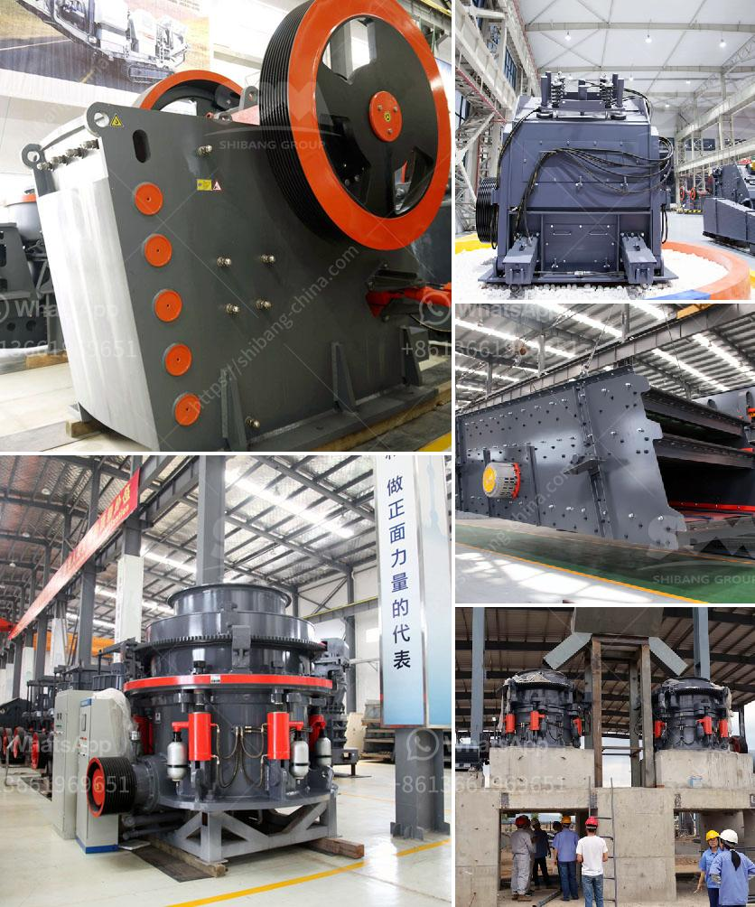

<h3>enquiry crushing machine</h3>
In today's fast-paced, technology-driven world, businesses are constantly on the lookout for innovative solutions to enhance efficiency and productivity. One such solution that has gained significant popularity is the enquiry crushing machine. With its ability to streamline the enquiry process and maximize resources, this technology has become an indispensable asset for many businesses.

An enquiry crushing machine is a sophisticated piece of equipment that automates and centralizes the enquiry management process. It allows businesses to efficiently handle and process large volumes of enquiries from various sources such as email, phone calls, and websites. Instead of manually sifting through countless enquiries, employees can utilize this machine to categorize, prioritize, and respond to inquiries in a fraction of the time.

One of the primary benefits of using an enquiry crushing machine is the optimization of resource allocation. By automating the initial stages of the enquiry process, businesses can reassign their employees to more value-adding tasks. This redistribution of resources improves overall productivity, allowing businesses to focus on core activities that directly contribute to their growth and success.

Moreover, enquiry crushing machines ensure consistent and prompt responses to customer inquiries. By setting predefined criteria for different enquiry types, businesses can ensure that appropriate responses are generated automatically. This eliminates the risk of delays or inconsistencies in responses, leading to increased customer satisfaction and loyalty.

Another advantage of these machines is their ability to capture and analyze valuable data. By integrating with existing customer relationship management (CRM) solutions, enquiry crushing machines can extract vital information from the enquiries. This data can then be used to identify customer trends, preferences, and pain points, allowing businesses to tailor their offerings and improve their overall customer experience.

Furthermore, enquiry crushing machines offer a greater level of control and accountability. With a centralized system in place, businesses can monitor and track the progress of enquiries throughout the entire process. This visibility ensures that no enquiries are left unanswered or overlooked, minimizing the risk of dissatisfied customers.

However, it is important to note that while enquiry crushing machines bring valuable advantages, they are not a complete substitute for human interaction. These machines should be seen as tools that augment and support employees rather than replacing them entirely. Human intervention is crucial for handling complex or sensitive enquiries that require a personal touch and empathy.

In conclusion, enquiry crushing machines have revolutionized the way businesses handle and process customer inquiries. By automating and centralizing the enquiry management process, these machines help streamline operations, allocate resources efficiently, and enhance customer satisfaction. Their integration with existing CRM solutions also provides businesses with invaluable data insights. When used in conjunction with human interaction, enquiry crushing machines can significantly improve business efficiency and contribute to long-term success.
<h3>Contact us</h3><ul><li><strong>Whatsapp:&nbsp;<a href="https://wa.me/8613661969651">+8613661969651</a></strong></li><li><a href="https://swt.shibang-china.com/?git&amp;zhl&amp;enquiry crushing machine"><strong>Online Service(chat now)</strong></a></li></ul><h3>Related</h3><ul><li><a href='5 micron grinding mill.md'>5 micron grinding mill</a></li><li><a href='china grinding unit.md'>china grinding unit</a></li><li><a href='operation crushing plant.md'>operation crushing plant</a></li><li><a href='stamler coal crusher.md'>stamler coal crusher</a></li><li><a href='crushers for granite aggregate.md'>crushers for granite aggregate</a></li></ul>