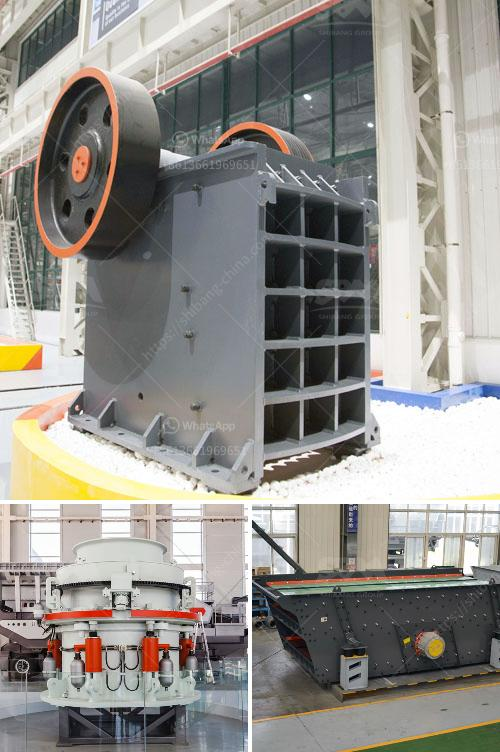

<h3>enquiry impact crusher</h3>
The mining industry is constantly evolving, and with this evolution comes the need for more efficient and effective equipment. One such equipment that has revolutionized the industry is the enquiry impact crusher. With its ability to crush materials into smaller sizes, these crushers have become an invaluable tool for mining operations worldwide.

The impact crusher works by using a high-speed rotating rotor that impacts the materials to be crushed against a curtain or apron. This impact causes the materials to break down and reduces them into smaller sizes. What sets the enquiry impact crusher apart from other crushers is its unique design that allows for a higher reduction ratio and improved energy efficiency.

One of the key advantages of using the enquiry impact crusher is its ability to produce a consistent and high-quality product. The crusher's design ensures that the materials are evenly distributed, resulting in a uniform product with minimal fines. This is crucial in industries such as construction and mining, where the quality and consistency of the material are essential for the success of the project.

Furthermore, the enquiry impact crusher is highly versatile and can efficiently handle a wide range of materials. Whether it is limestone, granite, or even ore, these crushers can handle it all. This versatility makes them a go-to choice for various mining applications.

Another significant advantage of the enquiry impact crusher is its low operational costs. With its high crushing capacity and energy efficiency, these crushers can reduce production costs significantly. Their robust construction also ensures a longer lifespan, reducing the need for frequent repairs and replacements.

In conclusion, the enquiry impact crusher is a game-changer in the mining industry. With its ability to crush materials efficiently and produce a high-quality product, these crushers have become an indispensable asset for mining operations. Their versatility, low operational costs, and durability make them a cost-effective solution for various applications. As mining operations continue to evolve, the enquiry impact crusher will continue to play a vital role in streamlining and enhancing the industry.
<h3>Contact us</h3><ul><li><strong>Whatsapp:&nbsp;<a href="https://wa.me/8613661969651">+8613661969651</a></strong></li><li><a href="https://swt.shibang-china.com/?git&amp;zhl&amp;enquiry impact crusher"><strong>Online Service(chat now)</strong></a></li></ul><h3>Related</h3><ul><li><a href='stone crushing machines for sale in philippines.md'>stone crushing machines for sale in philippines</a></li><li><a href='coconut shell powder mill machinery maker in sri lanka.md'>coconut shell powder mill machinery maker in sri lanka</a></li><li><a href='items for conveyor belts.md'>items for conveyor belts</a></li><li><a href='business plan on manganese ore mining crusher.md'>business plan on manganese ore mining crusher</a></li><li><a href='lime processing plant hammer mill.md'>lime processing plant hammer mill</a></li></ul>