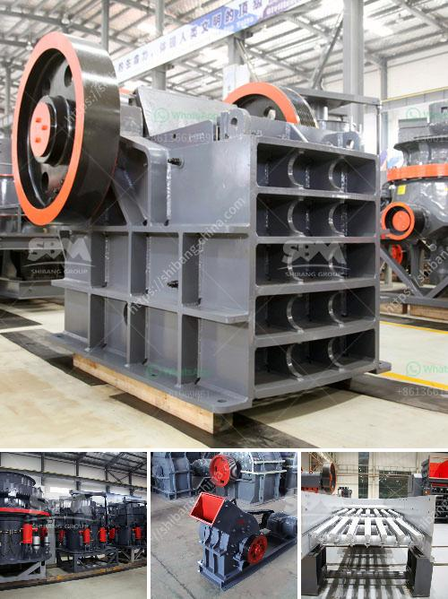

<h3>equipment for dimension stone production</h3>
Dimension stone refers to natural stone that is quarried and cut to specific sizes or shapes for use in various construction and architectural projects. The production of dimension stone requires specialized equipment to ensure precise and efficient extraction, cutting, and finishing of the stone.

One essential piece of equipment in dimension stone production is the diamond wire saw. This machine utilizes a diamond-impregnated wire to cut through the stone, allowing precise and clean cuts without causing any damage or waste. The diamond wire saw is highly flexible, enabling the extraction of large blocks or slabs in different shapes and sizes. This technology has revolutionized the dimension stone industry, as it offers speed, accuracy, and cost-effectiveness.

Another crucial equipment in dimension stone production is the block splitter. This device is used to break large blocks into smaller pieces, making them more manageable for transportation and further processing. The block splitter applies a powerful hydraulic force to split the stone cleanly and evenly along its natural grain. This process helps maximize the yield from each block and reduces waste.

Once the stone is cut into desired sizes, it undergoes various finishing processes such as polishing, honing, or flaming. To achieve these finishes, different types of equipment are used. Polishing machines with rotating abrasive heads are employed to smooth the surface of the stone and enhance its appearance. Honing machines, on the other hand, use abrasives to create a matte or satin finish, while flaming machines apply a high-temperature flame to create a textured or roughened surface.

In addition to cutting and finishing equipment, dimension stone production also requires handling and transportation equipment. Cranes, forklifts, and conveyors are used to move and transport large stone blocks or slabs within the quarry or processing facility. These machines help minimize the risk of worker injuries and facilitate the smooth flow of operations.

Furthermore, dust control equipment plays a vital role in ensuring a safe working environment and reducing environmental impact. Dust extraction systems and water suppression systems are installed in quarries and processing facilities to capture and control airborne dust particles generated during cutting, grinding, and other processes. By mitigating dust emissions, these equipment help protect workers' respiratory health and prevent pollution of surrounding areas.

To optimize the production process, digital technologies such as laser scanning and 3D modeling are increasingly being integrated into dimension stone production. Laser scanning provides precise measurements of the stone blocks or slabs, allowing more accurate planning and design. 3D modeling software enables efficient visualization and analysis of the stone before the cutting process, helping to minimize waste and optimize block selection.

In conclusion, the production of dimension stone heavily relies on specialized equipment to ensure efficient extraction, cutting, finishing, and transportation of the stone. Diamond wire saws, block splitters, polishing machines, and handling equipment are just a few examples. The integration of digital technologies further enhances the precision, sustainability, and productivity of dimension stone production. With the right equipment, the dimension stone industry continues to deliver high-quality natural stone for various construction and architectural applications.
<h3>Contact us</h3><ul><li><strong>Whatsapp:&nbsp;<a href="https://wa.me/8613661969651">+8613661969651</a></strong></li><li><a href="https://swt.shibang-china.com/?git&amp;zhl&amp;equipment for dimension stone production"><strong>Online Service(chat now)</strong></a></li></ul><h3>Related</h3><ul><li><a href='out used stone crusher in america.md'>out used stone crusher in america</a></li><li><a href='trading industrial stone crushers.md'>trading industrial stone crushers</a></li><li><a href='typical 100tph jaw crusher feed size.md'>typical 100tph jaw crusher feed size</a></li><li><a href='quartz stone crusher application.md'>quartz stone crusher application</a></li><li><a href='project report clay brick manufacturing.md'>project report clay brick manufacturing</a></li></ul>