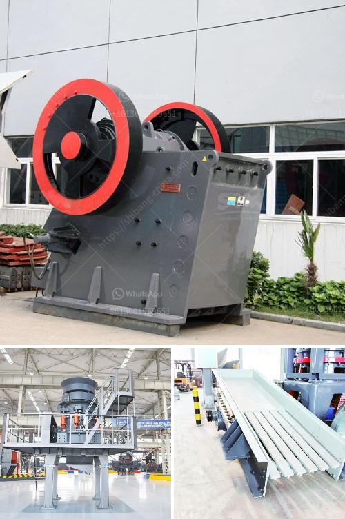

<h3>equipment used in iron ore beneficiation</h3>
Iron ore beneficiation is a multi-stage process that raw iron ore undergoes to purify it prior to the process of smelting, which involves melting the ore to remove the metal content. The process of iron ore beneficiation has two complementary goals and these define the methods used to refine it.

The iron content of the ore needs to be increased and gangue, which is native rock and minerals of lesser value within the ore itself, must be separated out. Methods such as screening, crushing, and grinding of iron ore are often used in various ways to purify it, along with several stages of magnetic separation.

The iron ore industry classifies the material by the concentration of the metal that is present after iron ore beneficiation has been completed. High-grade iron ore must have a concentration of 65% iron or higher, and medium grade of 62% to 65%. Low-grade iron ore includes all mixtures below 62% iron concentration, which are not considered to be viable types of ore for use in metallurgy.

Several different types of natural iron ore exist, but the two most common types used for metal refining are hematite, Fe2O3, which is usually 70% iron, and magnetite, Fe3O4, which is 72% iron. Low-grade iron ores also exist, such as limonite, which is hematite bonded to water molecules at 50% to 66% iron, and siderite, FeCO3, that is 48% iron. Different methods of iron ore beneficiation will be used depending on these properties.

Under normal circumstances, the greater the difference in specific gravity, the better the separation effect. Flotation, magnetic separation, and the gravity separation process are commonly used methods for sorting ores by their iron content, such as limonite, sulfide ore, and copper ore, and gold ore.

In the process of flotation, sulfur and other substances are added to sulfide ore and sulfur is used to separate sulfide ore from gangue and other substances. The separation results obtained by flotation are better than that of the magnetic separation during which the iron mine is magnetic. By employing magnetic separation, copper ore, which is non-magnetic can be separated from iron ore, and gangue particles. The separated magnetic material from the magnetic separator is transferred to a centrifuge where the non-magnetic material will undergo further processing.

In conclusion, equipment used in the iron ore beneficiation process includes jaw and cone crushers, vibrating screen, Super Fine Energy Saving Crusher, ball mill, magnetic separator, flotation machine, vibrating feeder, agitating tank, and so on. Most of these equipment is of high performance and efficiency for iron ore beneficiation, which ensures even and stable product quality.
<h3>Contact us</h3><ul><li><strong>Whatsapp:&nbsp;<a href="https://wa.me/8613661969651">+8613661969651</a></strong></li><li><a href="https://swt.shibang-china.com/?git&amp;zhl&amp;equipment used in iron ore beneficiation"><strong>Online Service(chat now)</strong></a></li></ul><h3>Related</h3><ul><li><a href='calcium carbonate grinding industries in india.md'>calcium carbonate grinding industries in india</a></li><li><a href='pe 500 750 jaw crusher price.md'>pe 500 750 jaw crusher price</a></li><li><a href='quote for cone crusher.md'>quote for cone crusher</a></li><li><a href='cement clinker plant machinery hyderabad.md'>cement clinker plant machinery hyderabad</a></li><li><a href='were to buy old rock crusher.md'>were to buy old rock crusher</a></li></ul>