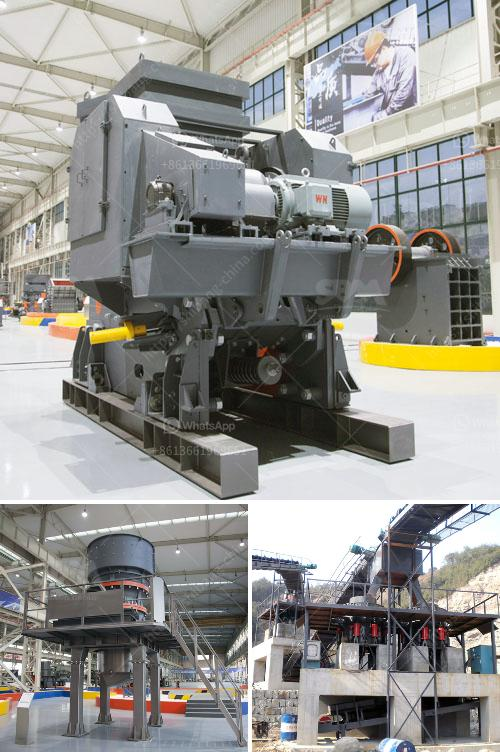

<h3>equipment used in quarry crusher</h3>
Quarries are vital resources for extraction of materials, such as limestone, gravel, and sand, used in construction and other industries. Crushers are an important part of this process to enhance the efficiency and effectiveness of material extraction from quarries. Here's an overview of the various types of equipment used in quarry crushers.

Firstly, jaw crushers are primary crushers used in quarries for breaking down large chunks of rock and ore into smaller pieces. These powerful machines have a stationary jaw and a movable jaw, which oscillates back and forth to apply pressure to the material. This compression force fractures the material, resulting in smaller fragments.

Secondly, cone crushers are used to further reduce the size of the material after it has been crushed by a jaw crusher. Cone crushers operate by squeezing the material between an eccentrically rotating mantle and a concave bowl. This crushing action produces smaller and more consistent-sized particles suitable for further processing.

Thirdly, impact crushers are utilized to crush materials that are not easily compressed, such as limestone and granite. These machines use a high-speed rotor with hammers or blow bars that impact the material, causing it to break apart. The resulting pieces can then be further processed or used as-is in various applications.

Additionally, vibrating screens play a crucial role in quarry crushers by separating and classifying different sizes of crushed material. These screens consist of a series of decks that vibrate to sort the material into various grades. This ensures that the end product meets the required specifications.

Finally, conveyors are essential equipment used to transport the material from one stage of the crushing process to another or to move the processed material for storage or shipment. They can be stationary or mobile and come in different configurations, such as belt, chain, or screw conveyors.

In conclusion, the equipment used in quarry crushers plays a pivotal role in enhancing productivity, efficiency, and safety in the material extraction process. Jaw crushers, cone crushers, impact crushers, vibrating screens, and conveyors are all essential components that work together to maximize the productivity of a quarry operation. These machines help break down raw materials into smaller, more manageable sizes, making them suitable for further processing and use.
<h3>Contact us</h3><ul><li><strong>Whatsapp:&nbsp;<a href="https://wa.me/8613661969651">+8613661969651</a></strong></li><li><a href="https://swt.shibang-china.com/?git&amp;zhl&amp;equipment used in quarry crusher"><strong>Online Service(chat now)</strong></a></li></ul><h3>Related</h3><ul><li><a href='stone gravel crusher price at ranchi.md'>stone gravel crusher price at ranchi</a></li><li><a href='project report clay brick manufacturing.md'>project report clay brick manufacturing</a></li><li><a href='granite stone processing plant.md'>granite stone processing plant</a></li><li><a href='iron ore crusher cost.md'>iron ore crusher cost</a></li><li><a href='stone crusher plant price list.md'>stone crusher plant price list</a></li></ul>