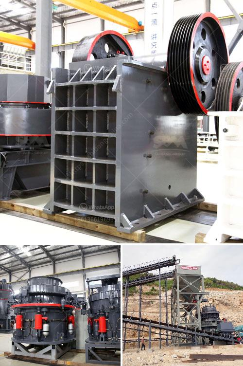

<h3>equipment used in small scale mining in ghana</h3>
Ghana is blessed with abundant natural resources, including gold, oil, and natural gas. These resources, together with an investor-friendly mining policy, attract several multinational companies to mine in the country. However, alongside these large-scale mining operations, there is a thriving sector of small scale mining in Ghana. 

Small scale mining refers to the process of extracting minerals or precious stones from the earth with limited resources and manpower. It usually operates at a smaller scale compared to medium to large scale mining operations. The small scale mining sector in Ghana is typically restricted to residents of the country, and it plays a crucial role in the local economy by providing jobs and improving the livelihoods of many individuals and communities.

In small scale mining, miners utilize a range of equipment designed to suit the unique needs of their operations. The type of equipment used depends on several factors, including the nature of the mining operation, the location, the deposit, and the available resources. While some equipment used may be basic and manually operated, others have evolved to become more sophisticated and mechanized over the years.

One common piece of equipment used in small scale mining is the sluice box. This traditional tool consists of a wooden or metal channel with riffles or bars that capture the heavier particles of gold as water flows through. Miners shovel material into the sluice box, allowing the water to wash away the lighter debris and leaving behind the gold. The sluice box is known for its simplicity and efficiency, making it a popular choice among small scale miners.

Another commonly used equipment is the gold pan. This simple, handheld tool has been used for centuries to separate gold from gravel or sand. Miners pour a mixture of dirt and water into the pan, swirling it around to allow the water to wash away the lighter materials and leaving the gold particles at the bottom. While the gold pan may be a basic tool, it requires skill and patience to efficiently extract gold using this method.

In recent years, small scale mining in Ghana has seen an increase in the use of machinery, particularly for ore processing. These machines are often fueled by diesel generators and are more efficient in crushing and processing ores compared to manual tools. Crushers, grinders, and concentrators are some examples of machinery used in small scale mining operations. These machines help extract valuable minerals or metals from the ore, enhancing the overall profitability of the mining operation.

It is crucial to note that sustainable mining practices and responsible use of equipment are fundamental in the small scale mining sector. The Ghanaian government has implemented regulations to ensure environmentally friendly operations and the safety of miners. Small scale miners are encouraged to form cooperatives or associations to collectively invest in modern and safe equipment, promoting increased efficiency and better working conditions.

In conclusion, the equipment used in small scale mining in Ghana varies depending on the nature of the operation and the available resources. From manual tools such as gold pans and sluice boxes to mechanized machinery like crushers and concentrators, these tools enable small scale miners to extract minerals and improve their livelihoods. As the sector continues to evolve, it is essential to adhere to sustainable mining practices and implement responsible use of equipment for the benefit of both the miners and the environment.
<h3>Contact us</h3><ul><li><strong>Whatsapp:&nbsp;<a href="https://wa.me/8613661969651">+8613661969651</a></strong></li><li><a href="https://swt.shibang-china.com/?git&amp;zhl&amp;equipment used in small scale mining in ghana"><strong>Online Service(chat now)</strong></a></li></ul><h3>Related</h3><ul><li><a href='vertical vertical roller mill drives.md'>vertical vertical roller mill drives</a></li><li><a href='barite grinding processing plant for sale.md'>barite grinding processing plant for sale</a></li><li><a href='used machines from china.md'>used machines from china</a></li><li><a href='limestone quarry operations.md'>limestone quarry operations</a></li><li><a href='used vertical grinding machine.md'>used vertical grinding machine</a></li></ul>