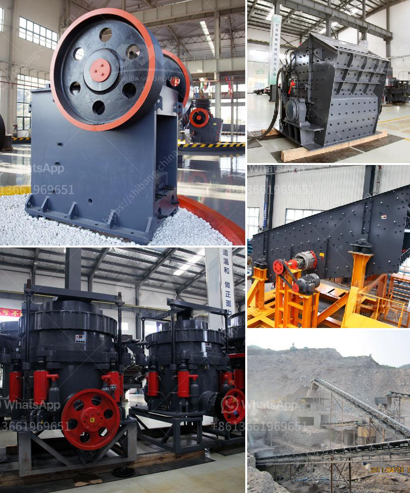

<h3>ethiopia stone crushing plant</h3>
Ethiopia is a country blessed with abundant natural resources. It has been experiencing rapid economic growth and development, especially in the infrastructure sector. The construction industry is a key driver of the country's economy, and stone crushing plants play a vital role in this sector.

Stone crushing plants are essential to the construction industry, as they produce the following materials needed for various construction activities:

1. Stones: The raw material used in the manufacture of aggregates for building purposes. Stones are crushed into different sizes to be used as construction materials, such as cement, asphalt, and concrete.

2. Sand: It is used as a fine aggregate in the production of concrete. Sand is obtained by crushing stones and sieving them to achieve the desired size.

3. Gravel: It is used as a coarse aggregate in concrete production. Gravel is obtained by crushing larger stones and sieving them to the required size.

Ethiopia's stone crushing plant is also capable of manufacturing different sizes of aggregates, rocks, and rock fillers for various construction purposes. The potential applications of these materials in the construction sector are manifold.

The crushed stone industry is a major contributor to and an indicator of the economic well-being of a nation. The demand for crushed stone is determined mostly by the level of construction activity and, therefore, the demand for construction materials. In Ethiopia, there is a growing demand for construction materials, fueled by the country's rapid economic growth and urbanization.

The stone crushing plant is operated informally by individuals who are not licensed or trained to carry out such activities. These informal stone crushing plants are not regulated by the government, which poses risks to the environment, as well as the health and safety of the workers.

To address these issues, the government of Ethiopia should consider establishing formal stone crushing plants that follow proper and strictly enforced regulations. This would ensure the sustainability of the industry and protect the environment and workers' safety.

The establishment of formal stone crushing plants will provide employment opportunities for the local population, while also reducing the dependency on imported construction materials. There is untapped potential in the Ethiopian construction industry for locally produced crushed stone materials, which can replace expensive imported materials.

Moreover, the establishment of stone crushing plants in Ethiopia should be supported by policies and regulations to ensure their smooth operation and sustainability. It is crucial to involve relevant stakeholders, such as the local community, government agencies, and private sector players, in the decision-making process to achieve a sustainable and responsible stone crushing industry.

In conclusion, stone crushing plants are essential to the construction industry, as they produce the materials needed for various construction activities. Ethiopia has experienced rapid economic growth, which is driving the demand for construction materials and creating employment opportunities. The establishment of formal stone crushing plants in Ethiopia is necessary to ensure their smooth operation and sustainable development.
<h3>Contact us</h3><ul><li><strong>Whatsapp:&nbsp;<a href="https://wa.me/8613661969651">+8613661969651</a></strong></li><li><a href="https://swt.shibang-china.com/?git&amp;zhl&amp;ethiopia stone crushing plant"><strong>Online Service(chat now)</strong></a></li></ul><h3>Related</h3><ul><li><a href='belt conveyor of cement plant technical data and price.md'>belt conveyor of cement plant technical data and price</a></li><li><a href='stone crusher plant in turkey.md'>stone crusher plant in turkey</a></li><li><a href='concrete aggregates crushing plant for sale.md'>concrete aggregates crushing plant for sale</a></li><li><a href='basalt mobile crusher price price.md'>basalt mobile crusher price price</a></li><li><a href='biggest cone crusher in africa.md'>biggest cone crusher in africa</a></li></ul>