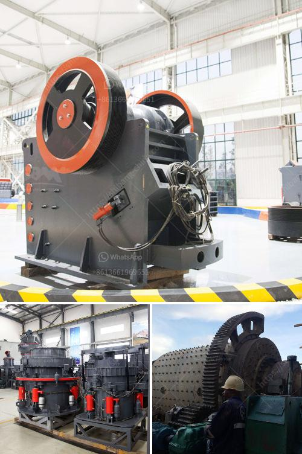

<h3>fairly used stone crusher for sale nigeria</h3>
Are you in need of equipment for crushing stones in Nigeria for your construction projects? A fairly used stone crusher can be found in Nigeria. This is a machine that is used to crush stones and rocks. They are usually utilized for filling road construction materials, building foundations, and railway ballast.

Stone crushing machines are durable and built with great strength, providing you with many years of service. These machines are easy to maintain and do not require frequent repairs, saving you both time and money in the long run. Additionally, they have minimal energy consumption, making them cost-effective and environmentally friendly.

Nigeria has a significant demand for construction materials, creating a market for used stone crushers. Investing in a fairly used stone crusher guarantees a reasonable return on investment. These machines are built to crush stones of all sizes and can also be used to recycle concrete waste into usable materials.

When purchasing a fairly used stone crusher, it is important to conduct thorough research. Evaluate the machine's capability, condition, and specifications to ensure it meets your requirements. Choose a reputable seller or dealer that can guarantee the equipment's quality and performance.

It is advisable to physically inspect the machine before completing the purchase. This will help you identify any potential issues or hidden problems that may compromise its functionality.

Whether you are a contractor, construction company or an individual looking to carry out building projects, a fairly used stone crusher is an excellent investment. It will provide you with the crushing capabilities you need while saving money compared to buying a new machine.

In conclusion, a fairly used stone crusher in Nigeria is a worthwhile investment option for contractors, construction companies, and individuals alike. It offers great durability, minimal maintenance, and a cost-effective solution for crushing stones and rocks. Take time to research and find a reliable seller to ensure you obtain a high-quality machine that meets your specific needs.
<h3>Contact us</h3><ul><li><strong>Whatsapp:&nbsp;<a href="https://wa.me/8613661969651">+8613661969651</a></strong></li><li><a href="https://swt.shibang-china.com/?git&amp;zhl&amp;fairly used stone crusher for sale nigeria"><strong>Online Service(chat now)</strong></a></li></ul><h3>Related</h3><ul><li><a href='gold mining machines manufacturers from italy.md'>gold mining machines manufacturers from italy</a></li><li><a href='china raymond roller mills.md'>china raymond roller mills</a></li><li><a href='how to select machines for stone crushing plant.md'>how to select machines for stone crushing plant</a></li><li><a href='the cost of chrome washing plants in south africa.md'>the cost of chrome washing plants in south africa</a></li><li><a href='cs series cone crusher.md'>cs series cone crusher</a></li></ul>