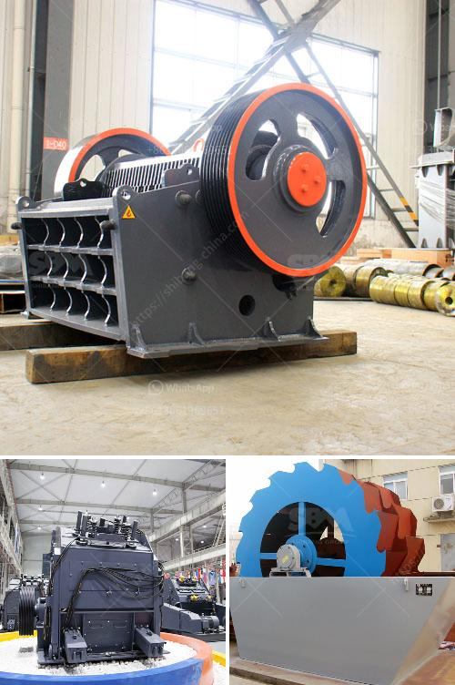

<h3>fdiferentes areas of stone crusher</h3>
Stone crushers are widely used in mining, metallurgy, building materials, highways, railways, water conservancy and chemical industries. They are capable of crushing various types of stones and ore materials. With the high-speed development of modern infrastructure, there is a growing demand for stone crushers in different areas.

Firstly, quarries are the main places where stone crushers are widely used. Quarries are the result of extracting raw materials from the earth's surface. Here, the extracted materials are crushed into smaller particles for further use. Quarries often have a variety of types of crushers like jaw crushers, impact crushers, and cone crushers to meet different particle size requirements.

Secondly, crushing equipment in mines is mainly used to crush ore and minerals, which requires a large production capacity. During the crushing process, stones and ores are constantly impacted by high-speed rotating hammers, thus wearing out the crushing equipment. Therefore, the durability and reliability of the crushers are crucial to ensure high productivity in mining operations.

Thirdly, stone crushers also play a vital role in water conservancy projects. In these projects, river pebble and cobblestone are used as raw materials to produce high-quality aggregates. Therefore, stone crushers are necessary equipment in the road and bridge construction as well as infrastructure projects.

Fourthly, stone crushers are also used for crushing baseball-sized or larger stones in the construction industry. These building materials are used in the construction of roads, buildings, and bridges, among other structures. To achieve the desired aggregate size, stone crushers employ a variety of techniques including compression, impact, and attrition.

Finally, stone crushers are also used in recycling applications. The growing emphasis on sustainability and environmental consciousness has led to the increased use of recycled materials in construction projects. Stone crushers are used to crush and separate recycled materials such as asphalt, concrete, and bricks for reuse in new projects.

In conclusion, stone crushers are widely used in various areas such as quarries, mines, water conservancy projects, construction sites, and recycling applications. The versatility and durability of these machines make them an essential investment for any business involved in the crushing of stones and ores. As technology advances, stone crushers are continuously evolving to meet the changing demands of different industries. Whether it is for mining, construction, or recycling, stone crushers play a crucial role in the efficient processing of raw materials.
<h3>Contact us</h3><ul><li><strong>Whatsapp:&nbsp;<a href="https://wa.me/8613661969651">+8613661969651</a></strong></li><li><a href="https://swt.shibang-china.com/?git&amp;zhl&amp;fdiferentes areas of stone crusher"><strong>Online Service(chat now)</strong></a></li></ul><h3>Related</h3><ul><li><a href='the cost of chrome washing plants in south africa.md'>the cost of chrome washing plants in south africa</a></li><li><a href='concrete crushing plant in dubai.md'>concrete crushing plant in dubai</a></li><li><a href='small diesel engine jaw crusher.md'>small diesel engine jaw crusher</a></li><li><a href='stone crushers for sale south africa second hand.md'>stone crushers for sale south africa second hand</a></li><li><a href='crushing plant tenova.md'>crushing plant tenova</a></li></ul>