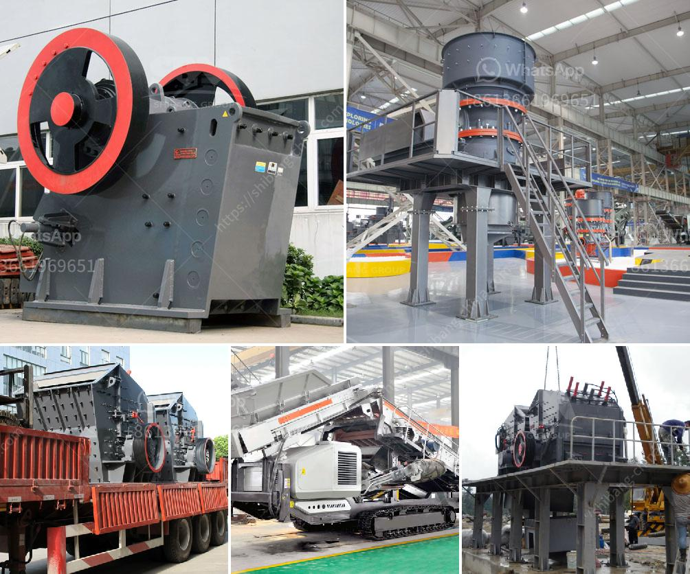

<h3>feasibility study for coal mining</h3>
A feasibility study is conducted before successfully starting a mining project as it is considered a critical step for a potential investor or mining company. It evaluates the economic and technical aspects of the project, determining whether it is viable, practical, and achievable. In the case of coal mining, a feasibility study plays a significant role in determining the potential profitability and sustainability of the operation.

Firstly, a feasibility study for coal mining involves coal resource evaluation and mine planning. This helps determine the quality, quantity, and grade of coal in the area, as well as the presence of any geological faults or disturbances. The evaluation also includes mining methods, production rate, project life, environmental aspects, infrastructure requirements, and capital and operating costs.

Secondly, the economic feasibility of the project is analyzed. This involves evaluating the potential demand for coal and market price trends. The study assesses whether the projected revenue from coal sales can cover the estimated operating expenses and generate a reasonable return on investment.

Additionally, the feasibility study examines the environmental impact of coal mining. It evaluates the potential disturbances to the local ecosystems, water resources, air quality, and nearby communities. Measures to mitigate and manage these impacts are also outlined in the study to ensure compliance with environmental regulations and sustainable practices.

Furthermore, a detailed analysis of the infrastructure requirements for coal mining is conducted. This includes determining the transportation methods to move coal from the mine site to customers or market outlets, whether by rail, road, or port. Adequate infrastructure is crucial to ensure smooth operations and timely delivery of coal.

In summary, conducting a feasibility study for coal mining is essential before initiating any large-scale mining project. It considers various factors such as coal resource evaluation, mine planning, economic feasibility, environmental impact assessment, and infrastructure requirements. A well-documented feasibility study provides potential investors and stakeholders with a comprehensive understanding of the project's viability, ensuring responsible and profitable coal mining operations.
<h3>Contact us</h3><ul><li><strong>Whatsapp:&nbsp;<a href="https://wa.me/8613661969651">+8613661969651</a></strong></li><li><a href="https://swt.shibang-china.com/?git&amp;zhl&amp;feasibility study for coal mining"><strong>Online Service(chat now)</strong></a></li></ul><h3>Related</h3><ul><li><a href='cost of cement manufacturing plant tons per day.md'>cost of cement manufacturing plant tons per day</a></li><li><a href='machine crusher prices in nigeria.md'>machine crusher prices in nigeria</a></li><li><a href='second hand conveyor belt adelaide.md'>second hand conveyor belt adelaide</a></li><li><a href='cost of stone crushing machine stone crusher quarry.md'>cost of stone crushing machine stone crusher quarry</a></li><li><a href='vibrating screens 250tph.md'>vibrating screens 250tph</a></li></ul>