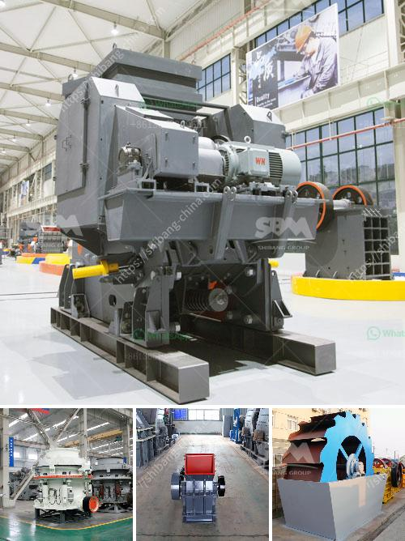

<h3>feldspar grinding machine chennai suppliers</h3>
Feldspar is a common raw material used in glassmaking, ceramics, and various other industries. It is one of the most important minerals in the world, and there is a high demand for feldspar grinding machine in the market. To meet this demand, suppliers in Chennai offer quality machines with advanced features and cutting-edge technology.

Chennai, the capital city of Tamil Nadu, has a thriving industrial sector that contributes significantly to the country's economy. The city is known for its manufacturing capabilities, and it is home to many reputed suppliers of grinding machines. These suppliers specialize in offering high-performance machines designed specifically for grinding feldspar.

Feldspar grinding machines are essential in the processing of feldspar materials. Grinding is an integral step in industrial processing, as it reduces the size of the material and prepares it for further processing. The grinding process ensures the uniform and fine particle size, which enhances the properties of the final product.

Suppliers in Chennai prioritize customer satisfaction and offer reliable machines that are easy to operate and maintain. The grinding machines manufactured by these suppliers are made from high-quality materials, ensuring durability and long service life. They are also equipped with efficient motors and advanced mechanisms that enable smooth and precise grinding operations.

Additionally, these suppliers provide excellent after-sales support, including installation, training, and maintenance services. This ensures that customers can maximize the performance of their feldspar grinding machines and minimize downtime.

In conclusion, suppliers in Chennai play a crucial role in meeting the demand for feldspar grinding machines. Their high-quality machines, advanced features, and excellent after-sales support make them a preferred choice for customers in the industry. Whether it is for glassmaking, ceramics, or other applications, these suppliers offer reliable and efficient machines that ensure optimum grinding results.
<h3>Contact us</h3><ul><li><strong>Whatsapp:&nbsp;<a href="https://wa.me/8613661969651">+8613661969651</a></strong></li><li><a href="https://swt.shibang-china.com/?git&amp;zhl&amp;feldspar grinding machine chennai suppliers"><strong>Online Service(chat now)</strong></a></li></ul><h3>Related</h3><ul><li><a href='difference between vsi and sand making machine.md'>difference between vsi and sand making machine</a></li><li><a href='principle of operation of stone crusher.md'>principle of operation of stone crusher</a></li><li><a href='manufacture of hammer mill.md'>manufacture of hammer mill</a></li><li><a href='crusher repairs south africa.md'>crusher repairs south africa</a></li><li><a href='quote for cone crusher.md'>quote for cone crusher</a></li></ul>