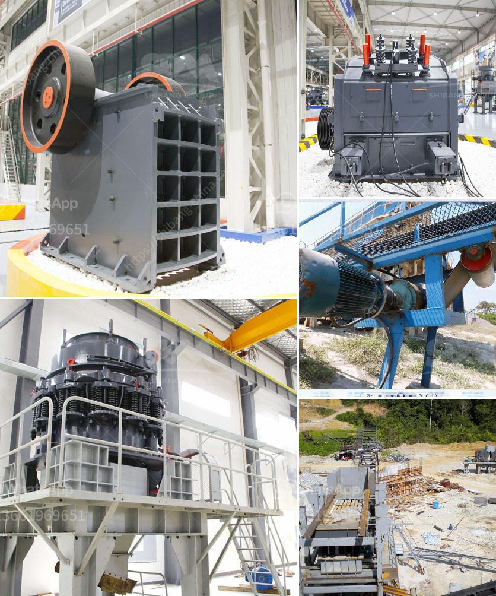

<h3>feldspar grinding mill</h3>
Feldspar is a mineral resource with high hardness and excellent versatility. It can be used in glass, ceramics, ceramics, abrasive materials, and other industries. With the boom of the construction industry, the demand for feldspar powder is increasing, which has promoted the development of feldspar grinding mills.

The feldspar grinding mill is a widely used milling machine. In the working process of the pendulum feldspar grinding mill, some common faults cannot be avoided. In order to reduce the loss caused by the fault, effective measures need to be taken in time to solve the problem. The following SBM will introduce to you several common fault solutions for the pendulum feldspar grinding mill:

1. Abnormal Vibration: The pendulum feldspar grinding mill, unlike traditional grinding mills, has a unique structural design that increases the grinding efficiency, and reduces the need for re-grinding of the material, saving time and improving production efficiency. The abnormal vibration caused by factors such as improper installation, improper synchronization of upper and lower pendulums, and uneven feeding of materials. These problems can be solved by adjusting the installation position, adjusting the tightness of the drive belt, and adjusting the feeding amount and speed.

2. Decrease in Output: The decrease in the output of the pendulum feldspar grinding mill may be caused by factors such as blockage of the air duct, blockage of the powder separator, too little wind, or too thick material layer on the millstone. To solve these problems, the air duct, powder separator, and powder collector should be cleaned regularly, and the wind volume and air volume should be adjusted appropriately.

3. Excessive Grinding: When the pendulum feldspar grinding mill is working, if the grinding time is too long or the grinding concentration is too high, it will cause excessive grinding of the material, resulting in excessive fine powder and reduced product quality. This problem can be solved by adjusting the feeding amount and speed, and controlling the grinding time.

The feldspar grinding mill is an all-round mill suitable for grinding a wide range of materials. It has outstanding performance, high efficiency, low maintenance cost, energy saving, and environmental protection. It can grind materials with Mohs hardness below 7 and humidity within 6%, and is suitable for grinding non-metallic minerals such as feldspar, calcite, talc, barite, fluorite, etc. It has become an ideal equipment for grinding industries such as water and electricity, metallurgy, building materials, chemicals, mining and other industries.
<h3>Contact us</h3><ul><li><strong>Whatsapp:&nbsp;<a href="https://wa.me/8613661969651">+8613661969651</a></strong></li><li><a href="https://swt.shibang-china.com/?git&amp;zhl&amp;feldspar grinding mill"><strong>Online Service(chat now)</strong></a></li></ul><h3>Related</h3><ul><li><a href='portable stone crushers uganda for sale.md'>portable stone crushers uganda for sale</a></li><li><a href='used machines from china.md'>used machines from china</a></li><li><a href='crusher machine philippine distributor and price.md'>crusher machine philippine distributor and price</a></li><li><a href='graphite mining india.md'>graphite mining india</a></li><li><a href='small diesel engine jaw crusher.md'>small diesel engine jaw crusher</a></li></ul>