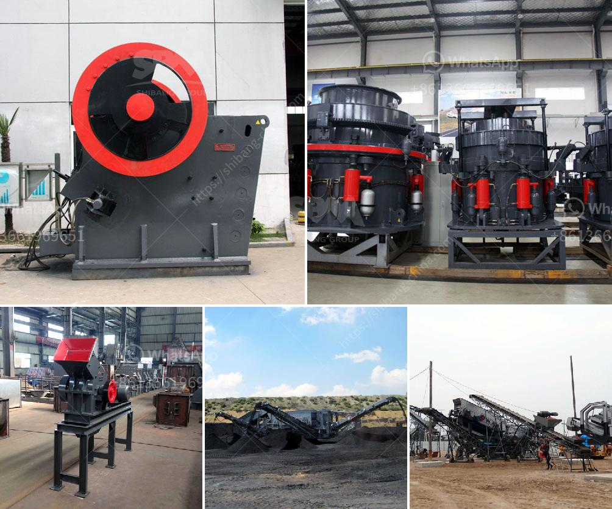

<h3>feldspar powder morbi</h3>
Morbi, a town located in the state of Gujarat, India, is known for its rich reserves of feldspar powder. This abundant natural resource has brought significant economic benefits to the region and has made Morbi a prominent player in the global feldspar market.

Feldspar is a group of rock-forming minerals that constitutes the most abundant mineral group on Earth. It is primarily composed of aluminum silicates mixed with potassium, sodium, calcium, and sometimes, barium. Known for its unique properties, feldspar has a wide range of applications across various industries.

Morbi's feldspar powder is renowned for its high-quality and purity. The local mining industry has employed advanced extraction techniques to ensure minimal impurities in the final product. The feldspar deposits in Morbi are exceptionally rich, making it a favored destination for mining companies.

One of the primary industries that has greatly benefited from Morbi's feldspar powder is the ceramic industry. Feldspar is a vital ingredient in the production of ceramics, particularly porcelain and tiles. Its unique combination of hardness, low thermal expansion, and resistance to chemical corrosion make it an ideal component for ceramic glazes, bodies, and frits.

Morbi's feldspar powder has gained recognition not only in national but also international markets. The availability of high-quality raw materials at affordable prices has attracted several ceramic manufacturers from around the globe to source their feldspar requirements from Morbi. This has significantly contributed to the region's economy, generating employment opportunities and boosting trade.

In addition to its relevance in the ceramics industry, feldspar powder also finds applications in glass manufacturing, abrasives, paints, and coatings. Its ability to act as a flux, reducing the melting point of other materials, makes it a crucial component in glass production. Feldspar's hardness and durability make it an excellent abrasive, commonly used in polishing and grinding.

Furthermore, feldspar is an essential ingredient in the production of paints and coatings. Its fine particles act as fillers, enhancing the strength, durability, and whiteness of the final product. Its chemical resistance also provides long-lasting protection against environmental factors.

Morbi's feldspar powder industry has played a vital role in the region's social and economic development. The revenue generated from feldspar exports has facilitated infrastructure development, such as improved roads, schools, and healthcare facilities. Moreover, it has elevated the living standards of the local community, providing them with sustainable livelihood opportunities.

However, it is crucial to ensure sustainable mining practices to protect the environment and safeguard the availability of this valuable resource for future generations. Local authorities and mining companies should work hand in hand to implement responsible mining practices, including land rehabilitation and the use of eco-friendly extraction techniques.

In conclusion, Morbi's feldspar powder is a rich natural resource that has transformed the region into a prominent player in the global feldspar market. Its high-quality and purity have made it a preferred choice in various industries, particularly ceramics. The economic benefits derived from feldspar mining have contributed to the region's growth and development. It is essential to ensure responsible mining practices to preserve this valuable resource for the long term.
<h3>Contact us</h3><ul><li><strong>Whatsapp:&nbsp;<a href="https://wa.me/8613661969651">+8613661969651</a></strong></li><li><a href="https://swt.shibang-china.com/?git&amp;zhl&amp;feldspar powder morbi"><strong>Online Service(chat now)</strong></a></li></ul><h3>Related</h3><ul><li><a href='barite crusher plant.md'>barite crusher plant</a></li><li><a href='ceramic ball mill.md'>ceramic ball mill</a></li><li><a href='jaw crusher 200 tonnes per hour.md'>jaw crusher 200 tonnes per hour</a></li><li><a href='cone crushers for 3 mm.md'>cone crushers for 3 mm</a></li><li><a href='multi hammer crusher.md'>multi hammer crusher</a></li></ul>