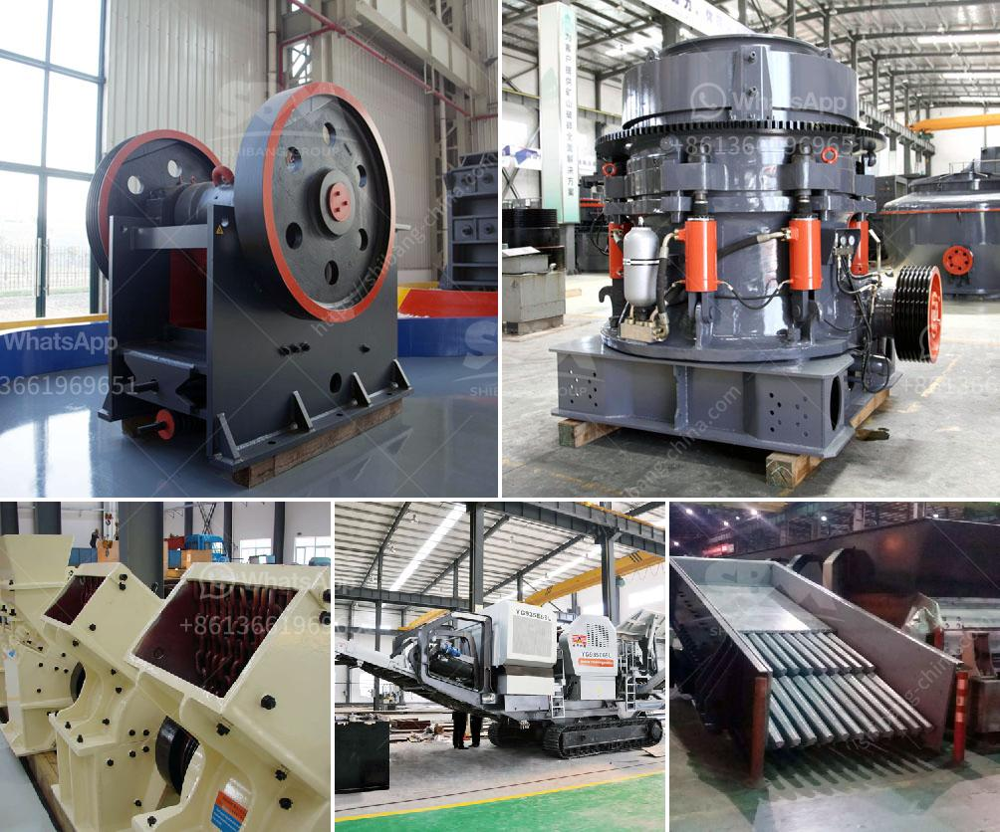

<h3>feldspar powder suppliers</h3>
Feldspar is a widely used mineral in various industries due to its versatility and abundance. It is a group of rock-forming minerals that are composed primarily of aluminum silicates, along with other elements such as potassium, sodium, and calcium. Feldspar is known for its unique properties, including its high melting point, low reactivity, and excellent insulation capabilities. These characteristics make it an important ingredient in the manufacturing of ceramics, glass, paint, and other products.

To meet the growing demand for feldspar, numerous suppliers have emerged in the market. These suppliers specialize in the production and distribution of feldspar powder, which is derived from the grinding and processing of feldspar rocks. Feldspar powder can be obtained in various grades and forms, depending on its intended application. The powder is typically white or pale-colored and has a fine texture that allows for easy incorporation into different materials.

One of the primary applications of feldspar powder is in the ceramic industry. Feldspar serves as a fluxing agent, meaning it helps lower the melting point of ceramic materials during firing, thus enhancing the formation of glassy phases and improving the overall strength and durability of ceramic products. The powder also acts as a filler, which helps control the shrinkage and warping of clay bodies during the drying and firing processes. Ceramic manufacturers rely on feldspar powder suppliers to ensure a consistent and reliable source of this essential mineral.

The glass industry is another major consumer of feldspar powder. Feldspar acts as a flux in glass production, helping to reduce the melting temperature and decrease energy consumption during the manufacturing process. The addition of feldspar powder also improves the chemical resistance, thermal stability, and mechanical strength of glass products. As glass manufacturers strive for higher quality and increased efficiency, they rely on reputable feldspar powder suppliers to provide them with the necessary raw materials.

Paint and coating companies also make use of feldspar powder in their formulations. The powder acts as a functional filler, improving the viscosity, flow, and leveling properties of paints and coatings. It also enhances the durability, abrasion resistance, and weatherability of the finished products. Feldspar powder suppliers play a crucial role in the paint industry by offering high-quality materials that meet the specific requirements of paint manufacturers.

With the increasing demand for feldspar powder, it is essential to choose reliable and trustworthy suppliers. A reputable supplier should have a consistent supply of high-quality feldspar powder, adhering to industry standards and regulations. They should also possess the necessary infrastructure, such as advanced grinding and processing facilities, to ensure the production of uniform and finely ground powder. Additionally, a good supplier should provide excellent customer service, including prompt delivery, technical support, and competitive pricing.

In conclusion, feldspar powder suppliers are essential partners in various industries that rely on this versatile mineral. These suppliers play a crucial role in ensuring a steady supply of high-quality feldspar powder, which is indispensable in the production of ceramics, glass, paint, and other applications. As the demand for feldspar powder continues to grow, it is crucial to establish strong and reliable partnerships with reputable suppliers to meet the requirements of modern manufacturing.
<h3>Contact us</h3><ul><li><strong>Whatsapp:&nbsp;<a href="https://wa.me/8613661969651">+8613661969651</a></strong></li><li><a href="https://swt.shibang-china.com/?git&amp;zhl&amp;feldspar powder suppliers"><strong>Online Service(chat now)</strong></a></li></ul><h3>Related</h3><ul><li><a href='silica sand crusher machinery.md'>silica sand crusher machinery</a></li><li><a href='crusher stone crusher de rio stone.md'>crusher stone crusher de rio stone</a></li><li><a href='crusher plant in nigeria pakistan.md'>crusher plant in nigeria pakistan</a></li><li><a href='crusher machine to make crushed sand from mm.md'>crusher machine to make crushed sand from mm</a></li><li><a href='mobile limestone crusher for sale indonessia.md'>mobile limestone crusher for sale indonessia</a></li></ul>