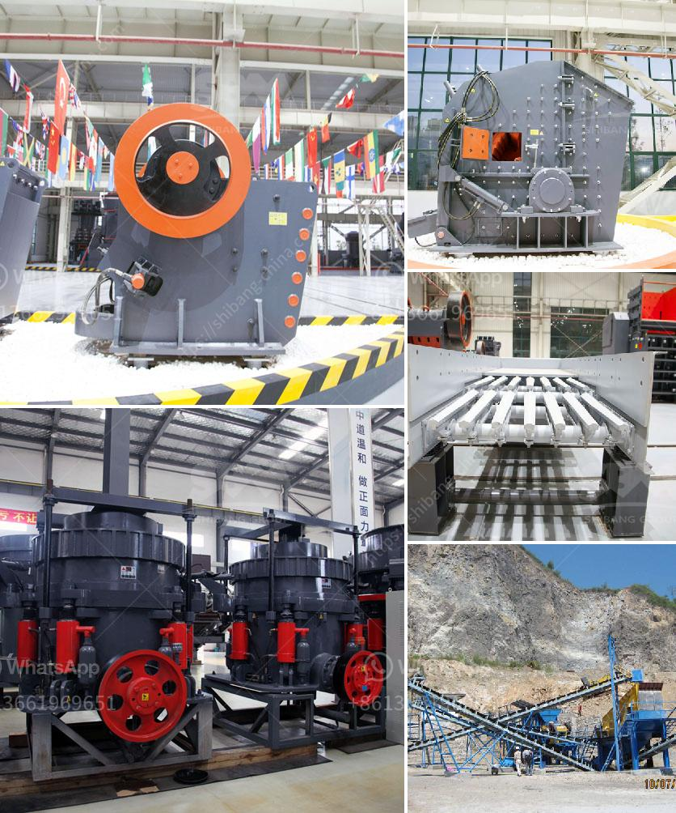

<h3>feldspar quarry processing plant</h3>
Feldspar is a common raw material used in ceramics, mining operations, and construction industries. It has many beneficial properties such as high melting point, hardness, and resistance to chemical corrosion. Feldspar is also known for its ability to form a glassy layer on ceramics, which helps increase their durability and strength.

To meet the growing demand for feldspar, there are several feldspar quarry processing plants around the world, where the feldspar is excavated, passed through a series of crushing and grinding processes, and then purified to remove impurities. After the final purification, the finished product is typically in the form of fine powder, which is used in various applications.

The feldspar quarry processing plant is one of the processes at the quarry extraction site where they break granite rocks into smaller sizes and produce fine granules for further processing. These fine granules are then used in the production of ceramics, and various other applications.

At the feldspar quarry processing plant, the principal objective of using blasting techniques is to loosen the material and break it into manageable pieces for further processing. The blasting process involves drilling holes, placing explosives, and then detonating them to break the granite into smaller pieces. This process can be carefully controlled to avoid damage to the valuable material and minimize environmental impact.

Once the material is broken down, it is transported to the crushing and grinding units of the processing plant. Cone crushers and rod mills are commonly used for this stage of the process. The cone crushers reduce the size of the material into even smaller pieces, while the rod mills grind the material into fine powder.

After the initial crushing and grinding, the material undergoes a purification process to remove impurities. This is typically done by a combination of gravity separation, magnetic separation, and flotation methods. Gravity separation involves using the difference in density between the feldspar and the impurities to separate them. Magnetic separation uses magnets to attract and separate the magnetic impurities, while flotation involves using chemicals to selectively separate the feldspar from other minerals.

Once the purification process is complete, the purified feldspar is then used in various applications. In the ceramics industry, it is used as a fluxing agent, which helps to lower the melting point of the ceramic material and improve its consistency. In the construction industry, feldspar is used as an additive in cement and concrete to improve their strength and durability.

In conclusion, the feldspar quarry processing plant plays a crucial role in the extraction, processing, and purification of feldspar. It is an essential step in ensuring the quality and consistency of feldspar products. The process also helps to minimize environmental impact by carefully controlling blasting techniques and utilizing purification methods to remove impurities. Overall, the feldspar quarry processing plant is an indispensable part of the feldspar supply chain, contributing to the development and growth of various industries.
<h3>Contact us</h3><ul><li><strong>Whatsapp:&nbsp;<a href="https://wa.me/8613661969651">+8613661969651</a></strong></li><li><a href="https://swt.shibang-china.com/?git&amp;zhl&amp;feldspar quarry processing plant"><strong>Online Service(chat now)</strong></a></li></ul><h3>Related</h3><ul><li><a href='stone sand making machine.md'>stone sand making machine</a></li><li><a href='rock crusher machine equipment in canada.md'>rock crusher machine equipment in canada</a></li><li><a href='screen and crusher hire.md'>screen and crusher hire</a></li><li><a href='how to make ball mill pdf.md'>how to make ball mill pdf</a></li><li><a href='crusher mill for china price.md'>crusher mill for china price</a></li></ul>