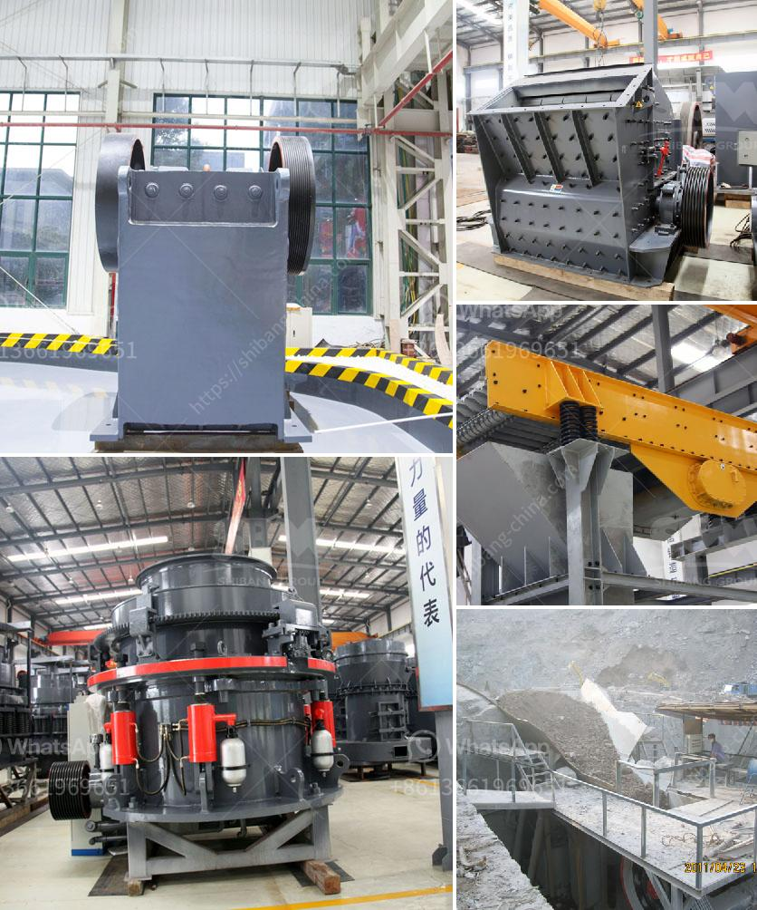

<h3>feldspar stone crusher</h3>
Feldspar Stone Crusher, a type of impact crusher, is widely used in secondary crushing in hydropower, highway, artificial aggregate, crushing and screening industries. It is especially suitable for crisp and hard-to-handle stone, such as basalt, granite, iron ore, quartz, and other minerals. This type of crusher is also applicable to crush various stones with different hardness in medium and fine crushing areas. It is widely used in industries like mining, metallurgy, cement, construction material, ceramic, chemical, etc.

The impact force generated by the crusher is relatively large at work. Stable and reliable performance, low energy consumption, high output, and large crushing ratio ensure excellent crushing efficiency.

The crusher is equipped with a multi-part counterattack plate system, which enables the material to be discharged through a close gap between the counterattack plates, ensuring the required discharge size can be achieved easily.

The wearing parts of the crusher are made of high-quality wear-resistant materials, which can endure long-term use without being easily damaged. This reduces the downtime and maintenance costs, ensuring the equipment can serve for a longer period.

The crusher uses hydraulic adjustment method to adjust the crushing size, and the hydraulic overload protection system as secured control measures to protect the equipment from overloading, preventing potential mechanical damages.

In conclusion, a Feldspar Stone Crusher is a crucial piece of equipment in mining operations, especially for reducing large rocks into smaller fragments. Based on the characteristics of feldspar, materials developed and produced by Hongxing Machinery, adopted advanced technology and modern design methods. Our equipment is both efficient and environmentally friendly, reducing pollution and protecting the planet for future generations. Anyone in need of a reliable and flexible crushing solution should explore the benefits of a Feldspar Stone Crusher.
<h3>Contact us</h3><ul><li><strong>Whatsapp:&nbsp;<a href="https://wa.me/8613661969651">+8613661969651</a></strong></li><li><a href="https://swt.shibang-china.com/?git&amp;zhl&amp;feldspar stone crusher"><strong>Online Service(chat now)</strong></a></li></ul><h3>Related</h3><ul><li><a href='crusher plant for sale in pakistan.md'>crusher plant for sale in pakistan</a></li><li><a href='calcium carbonate ball mill process.md'>calcium carbonate ball mill process</a></li><li><a href='granite crusher machine philippines.md'>granite crusher machine philippines</a></li><li><a href='equipment used in quarry crusher.md'>equipment used in quarry crusher</a></li><li><a href='track impact crusher.md'>track impact crusher</a></li></ul>