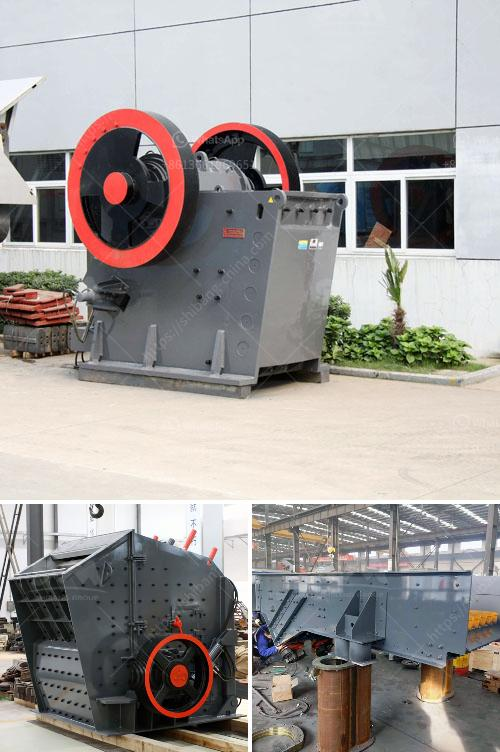

<h3>fluorite processing</h3>
Fluorite, a beautiful and vibrant mineral, has long fascinated those in the gemstone and mineral processing industries. Known for its incredible range of colors, fluorite can be found in shades of blue, green, purple, yellow, and pink, showcasing an array of hues that resemble the colors of a rainbow. But how is this stunning mineral processed to reveal its true beauty?

The processing of fluorite begins with the extraction of the mineral from its natural deposits. Fluorite is typically found in hydrothermal veins or as a primary mineral in various geological formations. Once discovered, the mineral is mined using conventional underground or open-pit mining techniques. 

After extraction, the fluorite undergoes a series of mechanical and chemical processes to obtain a marketable product. The mineral is crushed, often multiple times, to achieve a desired size range suitable for subsequent processing. It is then subjected to a flotation process, where reagents are used to separate fluorite from other minerals and impurities.

Flotation is the most widely used method for fluorite beneficiation. The process relies on the differences in surface properties between fluorite and other minerals. A carefully controlled mix of water, reagents, and air is introduced to a flotation cell, where the hydrophobic fluorite particles attach to air bubbles and rise to the surface, forming a froth. The froth is then skimmed off, dried, and further processed to obtain a high-grade fluorite concentrate.

The final step in fluorite processing involves various techniques to enhance the mineral's properties and appearance. Depending on the desired end use, the fluorite concentrate may undergo further crushing, grinding, and sizing to meet specific industry requirements. Alternatively, it can be processed into various forms, including rough or polished gemstones, ornamental carvings, or jewelry.

Fluorite processing is not only vital for meeting the demands of various industries but also for unleashing the hidden beauty of this captivating mineral. The vibrant colors and unique properties of fluorite make it a sought-after gemstone and mineral for collectors and enthusiasts worldwide. From its extraction to its final processing, the journey of fluorite showcases the intricate interplay between nature, science, and art, resulting in a mesmerizing array of color and elegance.
<h3>Contact us</h3><ul><li><strong>Whatsapp:&nbsp;<a href="https://wa.me/8613661969651">+8613661969651</a></strong></li><li><a href="https://swt.shibang-china.com/?git&amp;zhl&amp;fluorite processing"><strong>Online Service(chat now)</strong></a></li></ul><h3>Related</h3><ul><li><a href='quarry causer machine.md'>quarry causer machine</a></li><li><a href='germany stone crusher machine factories.md'>germany stone crusher machine factories</a></li><li><a href='gypsum manufacturing machine.md'>gypsum manufacturing machine</a></li><li><a href='gypsum factory machines in india.md'>gypsum factory machines in india</a></li><li><a href='sand sieve machine philippines.md'>sand sieve machine philippines</a></li></ul>